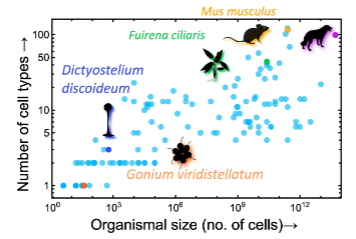
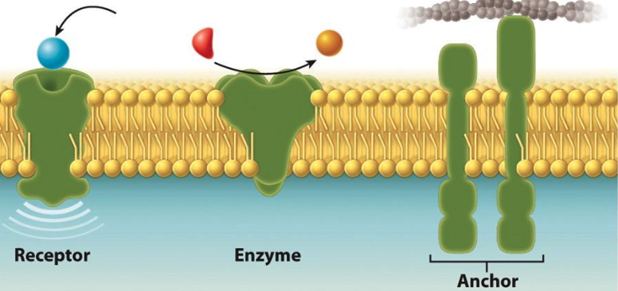
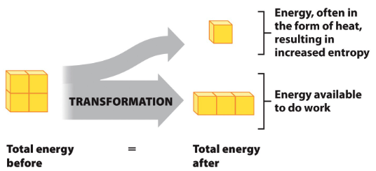
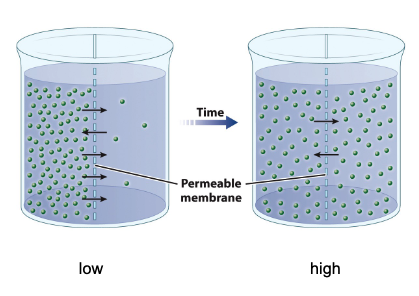
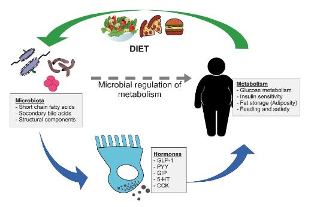
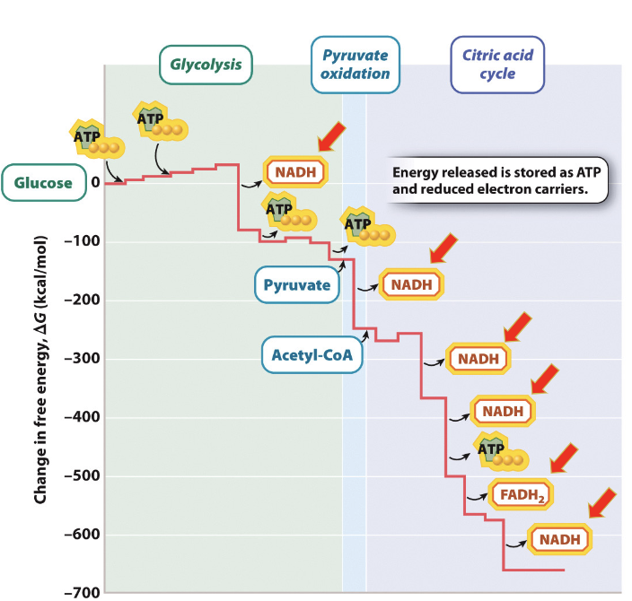
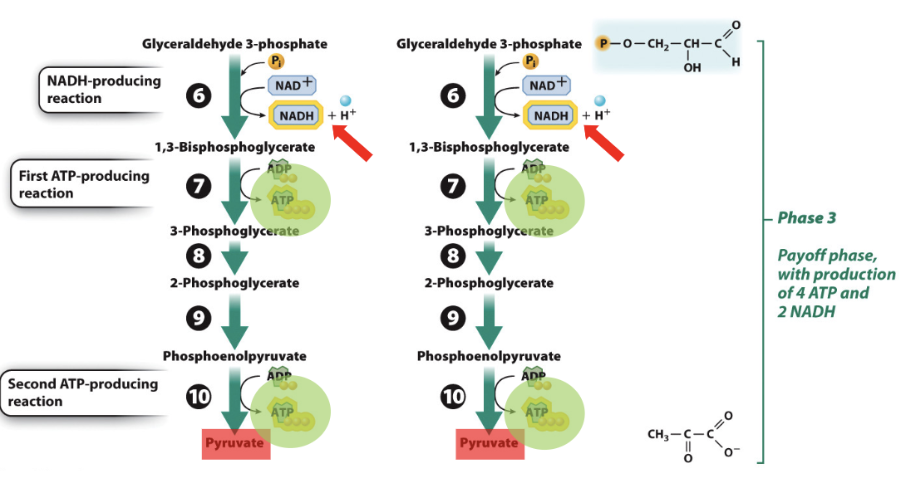
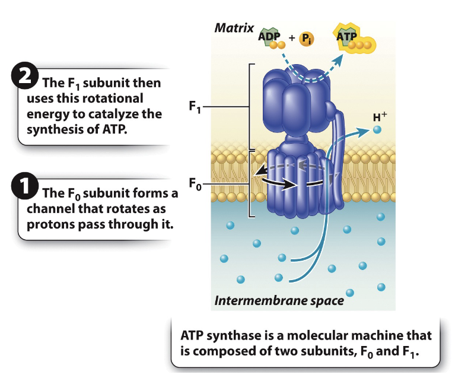
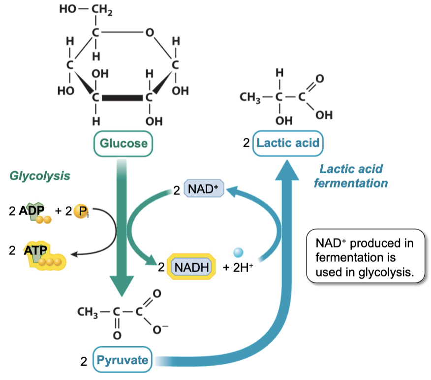
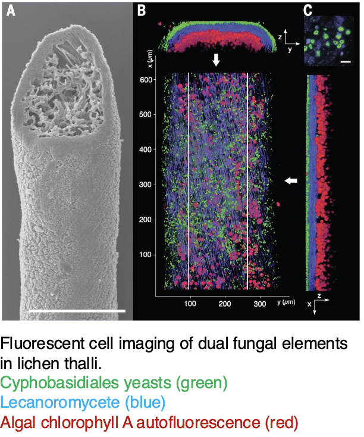

+++
title = '2. Cell Biology and Metabolism'
draft = false
+++

## Cell Structure and Components

### Core Concepts

1. **Cell membranes**
   - composed of lipids, proteins, and carbohydrates
2. **The plasma membrane**
   - a selective barrier
   - controls the movement of molecules between the inside and the outside of the cell
3. **The endomembrane system**
   - interconnected system of membranes
   - e.g., nuclear envelope, endoplasmic reticulum, golgi apparartus, lysosomes, vesicles, and plasma membrane
4. **Mitochondria and Chloroplasts**
   - Organelles involved in energy harvesting
   - Evolved from free-living prokaryotes

### Cell Theory

- All organisms are made up of cells
- The cell is the fundamental unit of life
- Cells come from pre-existing cells

Evolution of Cellular Differentiation

Microscopy

- Cryo-EM is developed in 2017
  

### Cell Membranes

Phospholipids

- Phospholipids are **amphipathic**
  - Polar head group (glycerol backbone, phosphate, choline) is hydrophilic
  - Fatty acid chains are hydrophobic

Lipid Structures

- **Micelle**: Large head and bulky with one hydrophobic tail buried
- **Bilayer**: Small head with two hydrophobic tails
- **Liposome**: Encoled bilayers composed of phospholipids

Cholesterol

- Component of _animal_ cell membranes
- A buffer to lessen the impact of the temperature on membrane fluidity
  

Membrane Proteins

- **Receptors**: allow the cell to receive signals from the environment
- **Enzymes**: catalyze chemical reactions
- **Anchors**: attach to another proteins that help maintain cell structure and shape
  
- **Integral Membrane Proteins**: permanently associated with cell membranes
- **Peripheral Membrane Proteins**: temporarily associated with lipid bilayer or with integral membrane proteins through weak noncovalent interactions
  
- **Transporters**: move ions or molecules across the membrane
  

### The Plasma Membranes

- Selective barrier that controls the movement of molecules between the inside and the outside of the cell (**selectively permeable**)

Diffusion

- The simplest movement into and out of cells
- Passive transport
- **Simple Diffusion**: direct transport of molecules allowed by the cell membrane
- **Facilitated Diffusion**: assisted transport of molecules through the action of transmembrane proteins e.g., carriers, channels

Osmosis

- Diffusion of water
- Effects of osmosis
  

[Hypertonic](#hypertonic)
[Hypotonic](#hypotonic)

### Plant Cell Wall and Vacuoles

Vacuole

- Storage of water and nutrients
- Storage and disposal of waste products and
- Supported by **turgor pressure**: force exerted by water pressing against an object

_Magnaporthe grisea_ and turgor pressure

- _M. grisea_ first attach to the leaves
- Then, synthesize melanin to incrase its turgor pressure
- Use the high turgor pressure to penetrate through host organism
- Subseuently occupy the host organism
- Absorb nutrients

### Types of Transport

Passive Transport

- Does not require energy
- Diffusion, Osmosis
- Through concentration gradient

Active Transport

- Requires energy
- **Primary Active Transport**
  - Move molecules in the opposite direction of the concentration gradient
  - The pumps are the **antiporter**
  - The transporters that move two molecules in the same direction are called **symporters** or **co-transporters**
- **Secondary Active Transport**
  - Movement of the coupled molecules is driven by the movement of protins, not direct ATP
  - Protons are pumped out of the cell by primary active transport
  - Electrochemical gradient from outside to inside the cell is now generated by protons
  - The antiporter move a different molecule out of the cell against its concentration gradient

### The Endomembrane System

- an interconnected system of membranes that includes the nuclear envelope, ER, Golgi apparatus, lysosomes, vesicles, and plasma membrane

Intercellular Movement of Molecules

- **Exocytosis**: vesicles generated from the endomembrane system fusing with the plasma membrane to deliver its contents into the extracellular space
- **Endocytosis**: material from outside the cell being brought into a vesicle

The Nuclear Envelope

- **Nuclear Pores**: membrane protein openings on the nuclear envelope -> essential for the nucleus to communicate with the rest of the cell
- Small molecules (e.g., ions) can passively diffuse through the pores
- Large protines and RNA require active transport
  

The Endoplasmic Reticulum

- Largest organelle in most eukaryotic cells
- Factory of lipids and proteins
- **Rough ER**: lots of ribosomes (reason for its name), synthesize proteins
- **Smooth ER**: lacks ribosomes, synthesize lipids
- **Ribosomes**: site of protein synthesis, amino acids are assembled into polypeptides

The Golgi Apparatus

- Modify proteins and lipids produced in the ER
- Sort proteins and lipids as they move to their final destinations (providing pathway)
- Synthesize carbohydrates

Lysosomes

- Degrade proteins, nucleic acids, lipids, and complex carbohydrates e.g., worn-out organelle
- Fuse with macromolecule that needs to be broken down
- Maintain acidic pH through proton pumps
- Useful broken-down molecules are recycled
- Waste molecules are expelled from cell

### Mitochondria and Chloroplasts

- Contain their own genomes
- Grow and multiply independently of other membrane compartments

### Distinguishing features of plants

- Cell wall
- Vacuole
- Chloroplasts
- Autotroph

## Metabolism and Cell Energy

Core concepts

1. **Metabolism**: the set of biochemical reactions that transform biomolecules and transfers energy
2. **Kinetic energy**: energy of motion
3. **Potential energy**: stored energy
4. **The laws of thermodynamics**: law that governs energy flow in biological systems

What do cells need?

- A membrane to separate the inside of the cell from the outside
- A way to encode and transmit information
- **ENERGY**

Adenosine Triphosphate (ATP)

- ATP stores potential energy using the bonds connecting the phosphate groups
- The energy level stored in each bond is different
- The highest energy bond is at the outer layer

### Metabolism

- The set of biochemical reactions that transforms biomolecules and transfers energy

Metabolic Classification

Types of Reactions

- **Catabolism**: breakdown of a molecule e.g., breakdown of macromolecules (carbs, proteins, fats, nucleic acids) into subunits (sugars, amino acids, fatty acids, nucleotides)
  - Energy is released
  - ADP -> ATP
- **Anabolism**: construction of a molecule e.g., construction of macromolecules (carbs, proteins, fats, nucleic acids) from subunits (sugars, amino acids, fatty acids, nucleotides)
  - Energy is consumed
  - ATP -> ADP

### Kinetic Energy

- Energy of motion

### Potential Energy

- Stored energy

Chemical Energy

- A form of potential energy held in the chemical bonds between pairs of atoms in a molecule
- Strong bonds have less potential energy

Packaged Energy

- ATP, a currency of energy
- Cells do not use all the available energy at once
- Cells package the energy into a chemical form that is readily accessible to the cell
- Chemical energy of ATP is held in the bonds linking the phosphate groups
- Break of each bond releases energy

### The Laws of Thermodynamics

- Governs energy flow in biological systems

First Law of Thermodynamics

- Conservation of energy
  

Second Law of Thermodynamics

- Energy transformation
  

Entropy

- Describes the amount of disorder
  

### Microbiome

- Consists of microbes that are helpful or harmful
- The microbiome associated with the human body has more cells than human cells
- Most are [mutualists](#mutualist) and [commensals](#commensal)
- In smaller numbers are pathogens (promoting disease)

Metabolism and Energy Efficiency of Human Host

- Human provides nutrient
- Microbiota regulate metabolism through hormone signals

Age

- Different age provides different microbiome profile
- That way, age of the host can be predicted using microbiome
- Also the health conditions of the host can be measured
  

## Chemical Reactions an Enzymes

Core Concepts

1. **Chemical Reactions**: involve the breaking and forming of bonds
2. **Energetic Coupling**: spontaneous reactions drive a non-spontaneous reactions
3. **Enzymes**: protein catalysts that can increase the rate of biochemical reactions
4. **Allosteric Enzymes**: an enzyme that is activated or inhibited when binding to another moecule changes its shape

### Chemical Reactions

- Catabolic reactions + Anabolic reactions

Free Radicals (Reactive Oxygen Species)

- Free radicals steal electrons
- Normal cells get damaged under oxidative stress due to free radicals
- Consumption of antioxidants can prevent it e.g., Selenium
- Selenoprotein translation generates proteins with selenocysteine that contain abundant selenium

Gibbs Free Energy ($\Delta G$)

- Energonic reaction: reactions with a positive $\Delta G$, require input of energy
- Exergonic reaction: reactions with a negative $\Delta G$, release energy

Energy Available
$$\text{Total Energy} (H)=\text{energy available to do work} + \text{energy lost to entropy}$$
$$\Delta G = \Delta H - T\Delta S$$

Gibbs Energy in different reactions

- Catabolic reaction:
  $$\Delta G \downarrow = \Delta H \downarrow  - T\Delta S \uparrow$$
- Anabolic reaction:
  $$\Delta G \uparrow = \Delta H \uparrow - T\Delta S \downarrow$$

### Energetic Coupling

- A process in which spontaneous reactions ($\Delta G<0$) drive a non-spontaneous reaction ($\Delta G > 0$)

e.g.,

Note that the two reactions share $P_i$, resulting in a coupled reaction

Note that the entire process is still considered spontaneous as the Gibbs free energy is negative after driving the energonic reaction

Intermediate Free Energy

- ATP: energy provider
  

Rate of a Reaction

- Transition state: unstable, has large energy
- Note that reactants require an activation energy, denoted $E_A$, to enter the transition state

### Enzymes

Protein catalysts that can increase the rate of biochemical reactions

- Enzyme-Catalzed Reactions
  $$\text{Substrate} (S) \leftrightarrow \text{Product} (P)$$
  $$S + \text{Enzyme} (E) \leftrightarrow ES \leftrightarrow EP \leftrightarrow E + P$$

Enzyme Shape

- **Active site** binds the **substrate** and converts it to the product
- Interaction between the substrate and the active site **decreases** the **activate energy** required

Active Site Formation

- The amino acids that form the active site are often composed of non-linear sequence of the unfolded enzyme
- Often specific for substrates (**Enzyme Specificity**)

Activators & Inhibitors

- **Activators**: activate/promote enzyme activities
- **Inhibitors**:
  - binds to the active site of the enzyme, competing with the substrate to reduce the rate of reaction
  - binds to the allosteric site of the **allosteric enzymes** to alter the shape of the enzyme and prevent substrate bindings

Why are some mushrooms toxic to human beings?

- **Amatoxins** are selective inhibitors of RNA polymerase II, which is a vital enzyme in the synthesis of mRNA, microRNA, and snRNA

### Allosteric Enzymes

Regulation of Chemical Reactions

- **Allosteric Enzyme**: an enzyme activated or inhibited by the change of shape resulting from the bindings of other molecules

## Cellular Respiration I

Core concepts

1. **Cellular Respiration**: a seris of catabolic reactions that convert the energy in fuel molecules into ATP
2. **Glycolysis**: the partial oxidation of glucose, results in the production of pyruvates, ATP, and reduced electron carriers
3. **Pyruvate Oxidation**: pyruvate is oxidized to acetyle-CoA, connecting glycolysis to the citric acid cycle
4. **The Citric Acid Cycle**: results in the complete oxidation of fuel molecules, the generation of ATP and reduced electron carriers
5. **The Electron Transport Chain**: transfers electrons from electron carriers to oxygen using the energy released to pump protons and synthesize ATP by oxidative phosphorylation

### Cellular Respiration

A series of catabolic reactions that convert the energy in fuel molecules into ATP

- Break down carbohydrates, lipids, and proteins
- Convert energy in fuel molecules into ATP
- Allow the cell to do work

Stages of Cellular Respiration

1. Glycolysis (cytoplasm)
2. Pyruvate Oxidation (Mitochondria)
3. Citric Acid Cycle (Mitochondria)
4. Oxidative Phosphorylation (Mitochondria)

### Generating ATP

- **Substrate-Level Phosphorylation**: ATP synthesis through hydrolysis reaction assisted forming an enzyme/substrate complex
- **Oxidative Phosphorylation**: Majority of ATP production

### Oxidation-Reduction Reactions

- **Oxidation**: loss of electrons
- **Reduction**: gain of electrons
- The oxygen atom oxidizes the glucose, it can be called the **oxidizing agent**
- Glucose is the **electron donor** and is considered the **reducing agent**

### Electron carriers

- $$NAD^+, NADH$$
- $$FAD, FADH_2$$
- The oxidized forms of these carriers are NAD+ and FAD
- The reduced forms of these carriers are NADH and FADH_2

### Glycolysis

The partial oxidation of glucose and results in the production of pyruvate, as well as ATP and reduced electron carriers

Phase 1

- Preparatory phase
- Consumption of 2 ATP
- The phosphorylation of glucose traps the molecule inside the cell and de-stabilizes it making it ready for phase 2

Phase 2

- Cleavage phase
- 6-carbon sugar is separated into two 3-carbon molecules

Phase 3

- Payoff phase
- Production of 4 ATP and 2 NADH

Products of Glycolysis
$$4 ATP - 2 ATP = 2 ATP \text{ (net gain)}$$
$$2 NADH$$
$$2 Pyruvate$$

### Pyruvate Oxidation

Pyruvate is oxidized to acetyle-CoA, connecting glycolysis to the citric acid cycle

- The pyruvate is transported into the mitochondrial matrix from the cytosol
- Then converted to acetyle-CoA within the mitochondria
  

Products of Pyruvate Oxidation
$$2 \times 1 CO_2$$
$$2 \times 1 NADH$$
$$2 \times 1 \text{Acetyle-CoA}$$

### Citric Acid Cycle

Results in the complete oxidation of fuel molecules and the generation of ATP and reduced electron carriers

- The citric acid cycle is known as the **Kreb's cycle** and the **TCA cycle**
- Takes place in mitochondrial matrix
- Fuel molecules are completely oxidiezed in this stage

Products of Citric Acid Cycle

$$2 \times 1 ATP$$
$$2 \times 3 NADH$$
$$2 \times 1 FADH_2$$
$$2 \times 2 CO_2$$

### Electron Transport Chain

Transfers electrons from electron carriers to oxygen, using the energy released to pump protons and synthesize ATP by oxidative phosphorylation

- Electrons in NADH enter the ETC via complex I
- Electrons in FADH2 enter the ETC via complex II

Electron transport

Proton transport and ATP synthesis

- The proton gradient has two components
  - A chemical gradient resulting from the different concentration of hydrogen ions
  - An electrical radient resulting from the difference in charge between the two sides

ATP Synthase

- The rotation of the $F_0$ subunit -> roation of the $F_1$ subunit
- The rotation of the $F_1$ subunit -> conformational changes that allow it to catalyze the synthesis of ATP

## Cellular Respiration II

Core Concepts

1. **Anaerobic Metabolism**: breakdown of glucose through fermentation, produces a modest amount of ATP
2. **Fermentation**: a process for extracting energy from fuel molecules without relying on oxygen or ETC, use an organic molecule
3. **Metabolic Integration**: metabolic pathways are integrated, allowing control of the energy level of cells

The Flow of Energy in Cellular Respiration

- 4 ATP produced by substrate-level phosphorylation per glucose
- Some energy transferred to 10 NADH and 2 FADH2 per glucose
- ATP Synthase converts the gradient to rotational energy to produce 28 ATP per glucose

### Anaerobic Metabolism

- breakdown of glucose through fermentation, produces a modest amount of ATP

### Fermentation

- a process for extracting energy from fuel molecules without relying on oxygen or ETC, use an organic molecule
- In the absence of oxygen, pyruvate molecules undergo fermentation instead of pyruvate oxidation

Lactic acid Fermentation

- Occur in anaerobic bacteria
- 2 Pyruvate is produced through glycolysis per glucose
- 2 Pyruvate is reduced to 2 lactic acid
- 2 NADH is oxidized to 2 NAD+
- 2 NAD+ is reused to produce 2 ATP in glycolysis
  
- e.g., production of yakult
  

Ethanol Fermentation

- Occur in yeast
- 2 Pyruvate is produced through glycolysis per glucose
- 2 Pyruvate lose 2 CO2 and form 2 Acetaldehyde
- 2 Acetaldehyde is reduced to 2 ethanol
- 2 NADH is oxidized to 2 NAD+
- 2 NAD+ is reused to produce 2 ATP in glycolysis
  
- e.g., wine, beers, bread

Rising Levels of Atmospheric Oxygen

- Before the presence of atmospheric oxygen, the earliest organism used one of the fermentation pathways
- Fermentation provide quick burst of ATP
- Higher efficiency in certain environments

### Metabolic Integration

- Metabolic pathways are integrated, allowing control of the energy level of cells

Glycogen Storage

- Glycogen has a core protein
- A core protein is surrounded by branches of glucose units
- Glycogen is stored in muscle cells -> muscle contraction
- Glycogen is stored in liver cells -> deliver energy and support cells
- Glucose molecules at the end of the branches can be cleaved one at a time
- Cleaved molecule is converted from glucose 1-phosphate to glucose 6-phosphate to undergo glycolysis

How other Sugars contribute to Glycolysis

- Monosaccharide, Disaccharide
  
- Polysaccharide
  

Ruminants and Microbes

- Ruminants do not have an enzyme to digest cellulose
- Rumens of herbivore ruminants are colonized by
  - Bacteria
  - Archaea
  - Fungi
  - Bacteriophages
- Microbes living in the rumen of the ruminants degrade cellulose

Evolution of Mitochondria

- Some eukaryotes lack mitochondria, possess **mitosome** instead
  

Hydrogenosomes in Anaerobic Fungi

- Hydrogenosomes are H2-producing mitochondrial homologs found in some anaerobic microbial eukarytoes
- Hydrogenosomes (H) are small (~0.5 um diameter)
- Spherical or variously elongate organelles

Regulation of Cellular Respiration

## Photosynthesis I

Core Concepts:

1. **Photosynthesis**: the major pathway by which energy and carbon are incorporated into carbohydrates
2. **The Calvin Cycle**: a three-step process that synthesizes carbohydrates from carbon dioxide
3. **Capturing Sunlight into Chemical Forms**: the light-harvesting reactions that use sunlight to produce the ATP and NADPH required by the Calvin Cycle

### Photosynthesis

- the major pathway by which energy and carbon are incorporated into carbohydrates

Energy in Biological Systems

- Photosynthesis provides an entry point to the majority of energy

Survival in Diverse Environment

- In desert, photosynthesis bacteria and unicellular algae form an easily disturbed layor on the surface (**desert crust**)
  
- Some live in extreme environment e.g., hot spring, glacier

Uncommon Photosynthetic Players

- _Nostoc sp._: example of a symbiosis
  
- _Geosiphon pyriforme_
  
- Lichen: fungi + algae/cyanobacteria
  - Multiple fungal elements can be involved
    

General Equation for Photosynthesis
$$CO_2 + H_2O \rightarrow C_6H_{12}O_6 + O_2$$

- Type of a reaction
- Oxidation of water is linked with the reduction of carbon dioxide
- Series of redox reaction to oxidize water make up the **photosynthetic electron transport chain**

Photosystem

- Photosynthesis begins with the absorption of light by protein-pigment complexes (**photosystems**)
- Absorbed light is used to drive redox reactions
- The movement of electrons through the chain is used to drive the synthesis of ATP and NADPH
- ATP and NADPH are the energy sources required for Calvin cycle

The Chloroplast

- Thylakoid membranes form structures that resemble flattened sacs, grouped into grana
  

Cellular Respiration vs. Photosynthesis

- Notice that the reactions are the opposite of one another
- Photosynthesis generates fuel molecules (by fixing carbons)

### The Calvin Cycle

- a three-step process that synthesizes carbohydrates from carbon dioxide

Three steps

1. Carboxylation: addition of CO2 to the 5-carbon compound, RuBP (done by **rubisco**)

- 6-carbon molecule is broken down into two 3-carbon molecules, **3-PGA**

2. Reduction: energy input form ATP and NADPH

- **NADPH** is the reducing agent
- The reduction of 3-PGA requires ATP and NADPH

3. Regeneration of RuBP: 3-carbon compounds are reorganized and combined to produce RuBP

- $$5\times 3C \rightarrow 3 \times 5C$$

Energy Storage

- Excessively produced glucose is stored as starch granules

### Sunlight into Chemical Forms

- the light-harvesting reactions that use sunlight to produce the ATP and NADPH required by the Calvin Cycle

Light Absorption

- Light is a type of electromagnetic radiation
- Pigments absorb some wavelegths of visible light
- Pigments look colored as they reflect light enriched in the wavelengths that they do not absorb
  

Chlorophyll Light Absorption

- Chlorophyll appears green as it poorly absorbs green wavelengths
- Chlorophyll molecules are bound by their tail region to integral membrane proteins in the thylakoid membrane
- Hydrocarbon tail anchors the chlorophyll to cell
  
- Light energy is absorbed through chlorophyll in an electorns and sent to reaction center

Reaction Center

- Possess distinct configuration
- Transfer energy to the electron acceptor

## Terminologies

**hypertonic**: having a lower concentration of solute

**hypotonic**: having a higher concentration of solute

**mutualist**: a type of relationship between the host and symbiont where both organisms benefit and no one is harmed

**commensal**: a type of relationsip between the host and symbiontwhere one species obtains food or other benefits from the other without harming or benefiting the latter
