+++
title = '2. Cell Biology and Metabolism'
draft = false
toc = true
math = true
bold = true
+++

## Cell Structure and Components

### Core Concepts

1. **Cell membranes**
   - composed of lipids, proteins, and carbohydrates
2. **The plasma membrane**
   - a selective barrier
   - controls the movement of molecules between the inside and the outside of the cell
3. **The endomembrane system**
   - interconnected system of membranes
   - e.g., nuclear envelope, endoplasmic reticulum, golgi apparartus, lysosomes, vesicles, and plasma membrane
4. **Mitochondria and Chloroplasts**
   - Organelles involved in energy harvesting
   - Evolved from free-living prokaryotes

### Cell Theory

- All organisms are made up of cells
- The cell is the fundamental unit of life
- Cells come from pre-existing cells

Evolution of Cellular Differentiation

Microscopy

- Cryo-EM is developed in 2017
  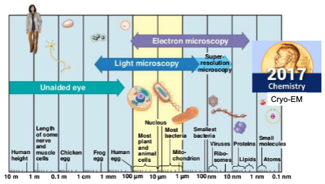

### Cell Membranes

Phospholipids

- Phospholipids are **amphipathic**
  - Polar head group (glycerol backbone, phosphate, choline) is hydrophilic
  - Fatty acid chains are hydrophobic

Lipid Structures

- **Micelle**: Large head and bulky with one hydrophobic tail buried
  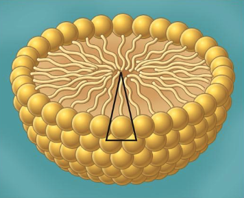
- **Bilayer**: Small head with two hydrophobic tails
  
- **Liposome**: Encoled bilayers composed of phospholipids
  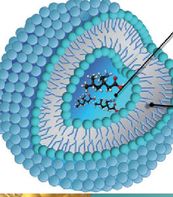

Cholesterol

- Component of _animal_ cell membranes
- A buffer to lessen the impact of the temperature on membrane fluidity
  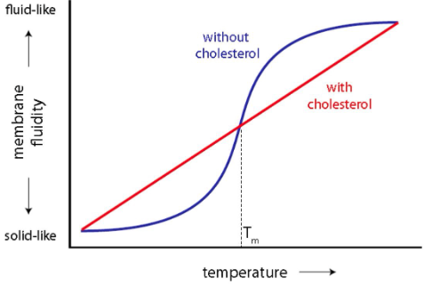

Membrane Proteins

- **Receptors**: allow the cell to receive signals from the environment
- **Enzymes**: catalyze chemical reactions
- **Anchors**: attach to another proteins that help maintain cell structure and shape
  
- **Integral Membrane Proteins**: permanently associated with cell membranes
- **Peripheral Membrane Proteins**: temporarily associated with lipid bilayer or with integral membrane proteins through weak noncovalent interactions
  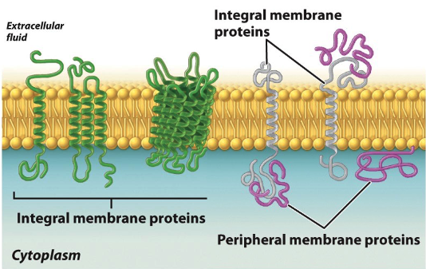
- **Transporters**: move ions or molecules across the membrane
  

### The Plasma Membranes

- Selective barrier that controls the movement of molecules between the inside and the outside of the cell (**selectively permeable**)

Diffusion

- The simplest movement into and out of cells
- Passive transport
- **Simple Diffusion**: direct transport of molecules allowed by the cell membrane
- **Facilitated Diffusion**: assisted transport of molecules through the action of transmembrane proteins e.g., carriers, channels
  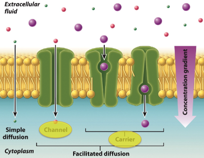
  Osmosis

- Diffusion of water
- Effects of osmosis
  

[Hypertonic](#hypertonic)
[Hypotonic](#hypotonic)

### Plant Cell Wall and Vacuoles

Vacuole

- Storage of water and nutrients
- Storage and disposal of waste products and
- Supported by **turgor pressure**: force exerted by water pressing against an object

_Magnaporthe grisea_ and turgor pressure

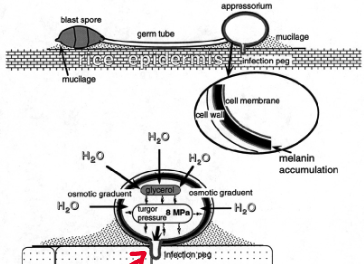

- _M. grisea_ first attach to the leaves
- Then, synthesize melanin to incrase its turgor pressure
- Use the high turgor pressure to penetrate through host organism
- Subseuently occupy the host organism
- Absorb nutrients

### Types of Transport

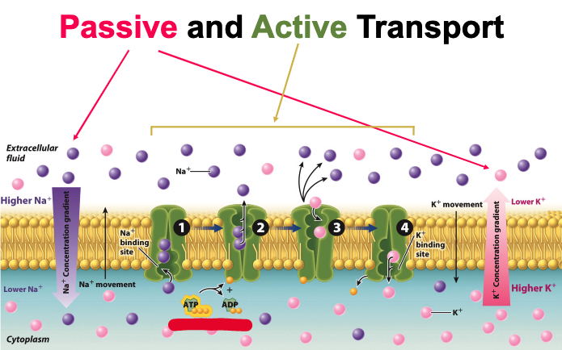
Passive Transport

- Does not require energy
- Diffusion, Osmosis
- Through concentration gradient

Active Transport

- Requires energy
- **Primary Active Transport**
  - The pumps that move two molecules in the opposite directions are the **antiporter**
    
  - The transporters that move two molecules in the same direction are called **symporters** or **co-transporters**
    
- **Secondary Active Transport**
  - Movement of the coupled molecules is driven by the movement of protins, not direct ATP
  - Protons are pumped out of the cell by primary active transport
  - Electrochemical gradient from outside to inside the cell is now generated by protons
  - The antiporter move a different molecule out of the cell against its concentration gradient
    

### The Endomembrane System

- an interconnected system of membranes that includes the nuclear envelope, ER, Golgi apparatus, lysosomes, vesicles, and plasma membrane

Intercellular Movement of Molecules

- **Exocytosis**: vesicles generated from the endomembrane system fusing with the plasma membrane to deliver its contents into the extracellular space
- **Endocytosis**: material from outside the cell being brought into a vesicle
  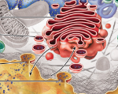

The Nuclear Envelope

- **Nuclear Pores**: membrane protein openings on the nuclear envelope -> essential for the nucleus to communicate with the rest of the cell
- Small molecules (e.g., ions) can passively diffuse through the pores
- Large protines and RNA require active transport
  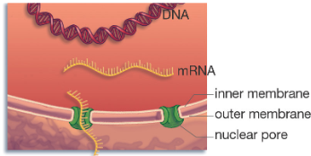

The Endoplasmic Reticulum

- Largest organelle in most eukaryotic cells
- Factory of lipids and proteins
- **Rough ER**: lots of ribosomes (reason for its name), synthesize proteins
- **Smooth ER**: lacks ribosomes, synthesize lipids
- **Ribosomes**: site of protein synthesis, amino acids are assembled into polypeptides
  

The Golgi Apparatus

- Modify proteins and lipids produced in the ER
- Sort proteins and lipids as they move to their final destinations (providing pathway)
- Synthesize carbohydrates
  

Lysosomes

- Degrade proteins, nucleic acids, lipids, and complex carbohydrates e.g., worn-out organelle
- Fuse with macromolecule that needs to be broken down
- Maintain acidic pH through proton pumps
- Useful broken-down molecules are recycled
- Waste molecules are expelled from cell
  

### Mitochondria and Chloroplasts

- Contain their own genomes
- Grow and multiply independently of other membrane compartments

### Distinguishing features of plants

- Cell wall
- Vacuole
- Chloroplasts
- Autotroph

## Metabolism and Cell Energy

Core concepts

1. **Metabolism**: the set of biochemical reactions that transform biomolecules and transfers energy
2. **Kinetic energy**: energy of motion
3. **Potential energy**: stored energy
4. **The laws of thermodynamics**: law that governs energy flow in biological systems

What do cells need?

- A membrane to separate the inside of the cell from the outside
- A way to encode and transmit information
- **ENERGY**

Adenosine Triphosphate (ATP)
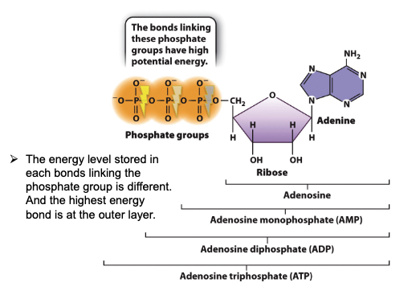

- ATP stores potential energy using the bonds connecting the phosphate groups
- The energy level stored in each bond is different
- The highest energy bond is at the outer layer

### Metabolism

- The set of biochemical reactions that transforms biomolecules and transfers energy

Metabolic Classification
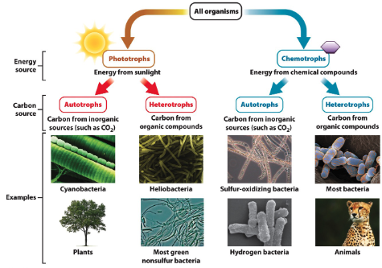

Types of Reactions

- **Catabolism**: breakdown of a molecule e.g., breakdown of macromolecules (carbs, proteins, fats, nucleic acids) into subunits (sugars, amino acids, fatty acids, nucleotides)
  - Energy is released
  - ADP -> ATP
- **Anabolism**: construction of a molecule e.g., construction of macromolecules (carbs, proteins, fats, nucleic acids) from subunits (sugars, amino acids, fatty acids, nucleotides)
  - Energy is consumed
  - ATP -> ADP

### Kinetic Energy

- Energy of motion

### Potential Energy

- Stored energy

Chemical Energy

- A form of potential energy held in the chemical bonds between pairs of atoms in a molecule
- Strong bonds have less potential energy

Packaged Energy

- ATP, a currency of energy
- Cells do not use all the available energy at once
- Cells package the energy into a chemical form that is readily accessible to the cell
- Chemical energy of ATP is held in the bonds linking the phosphate groups
- Break of each bond releases energy

### The Laws of Thermodynamics

- Governs energy flow in biological systems

First Law of Thermodynamics

- Conservation of energy
  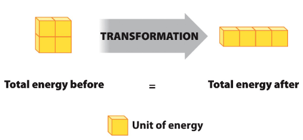

Second Law of Thermodynamics

- Energy transformation
  

Entropy

- Describes the amount of disorder
  

### Microbiome

- Consists of microbes that are helpful or harmful
- The microbiome associated with the human body has more cells than human cells
- Most are [mutualists](#mutualist) and [commensals](#commensal)
- In smaller numbers are pathogens (promoting disease)

Metabolism and Energy Efficiency of Human Host

- Human provides nutrient
- Microbiota regulate metabolism through hormone signals

Age

- Different age provides different microbiome profile
- That way, age of the host can be predicted using microbiome
- Also the health conditions of the host can be measured
  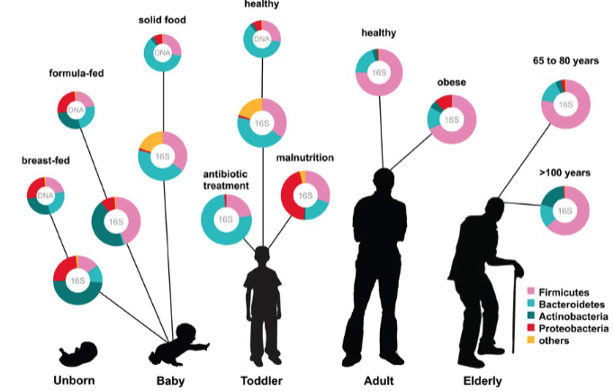

## Chemical Reactions an Enzymes

Core Concepts

1. **Chemical Reactions**: involve the breaking and forming of bonds
2. **Energetic Coupling**: spontaneous reactions drive a non-spontaneous reactions
3. **Enzymes**: protein catalysts that can increase the rate of biochemical reactions
4. **Allosteric Enzymes**: an enzyme that is activated or inhibited when binding to another moecule changes its shape

### Chemical Reactions

- Catabolic reactions + Anabolic reactions

Free Radicals (Reactive Oxygen Species)

- Free radicals steal electrons
- Normal cells get damaged under oxidative stress due to free radicals
- Consumption of antioxidants can prevent it e.g., Selenium
- Selenoprotein translation generates proteins with selenocysteine that contain abundant selenium

Gibbs Free Energy ($\Delta G$)

- Energonic reaction: reactions with a positive $\Delta G$, require input of energy
- Exergonic reaction: reactions with a negative $\Delta G$, release energy

Energy Available
$$\text{Total Energy} (H)=\text{energy available to do work} + \text{energy lost to entropy}$$
$$\Delta G = \Delta H - T\Delta S$$

Gibbs Energy in different reactions

- Catabolic reaction:
  $$\Delta G \downarrow = \Delta H \downarrow  - T\Delta S \uparrow$$
- Anabolic reaction:
  $$\Delta G \uparrow = \Delta H \uparrow - T\Delta S \downarrow$$

### Energetic Coupling

- A process in which spontaneous reactions ($\Delta G<0$) drive a non-spontaneous reaction ($\Delta G > 0$)

e.g.,
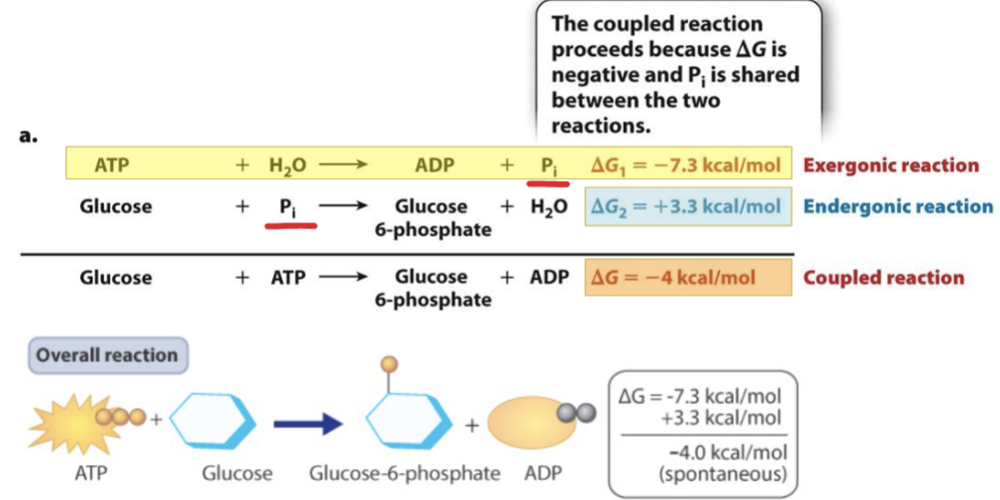
Note that the two reactions share $P_i$, resulting in a coupled reaction

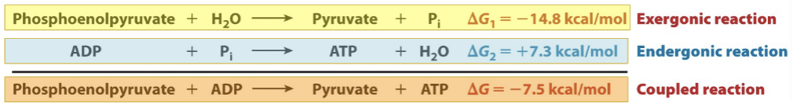
Note that the entire process is still considered spontaneous as the Gibbs free energy is negative after driving the energonic reaction

Intermediate Free Energy

- ATP: energy provider
  

Rate of a Reaction

- Transition state: unstable, has large energy
- Note that reactants require an activation energy, denoted $E_A$, to enter the transition state

### Enzymes

Protein catalysts that can increase the rate of biochemical reactions

- Enzyme-Catalzed Reactions
  $$\text{Substrate} (S) \leftrightarrow \text{Product} (P)$$
  $$S + \text{Enzyme} (E) \leftrightarrow ES \leftrightarrow EP \leftrightarrow E + P$$

Enzyme Shape

- **Active site** binds the **substrate** and converts it to the product
- Interaction between the substrate and the active site **decreases** the **activate energy** required

Active Site Formation

- The amino acids that form the active site are often composed of non-linear sequence of the unfolded enzyme
- Often specific for substrates (**Enzyme Specificity**)

Activators & Inhibitors

- **Activators**: activate/promote enzyme activities
- **Inhibitors**:
  - binds to the active site of the enzyme, competing with the substrate to reduce the rate of reaction
  - binds to the allosteric site of the **allosteric enzymes** to alter the shape of the enzyme and prevent substrate bindings

Why are some mushrooms toxic to human beings?

- **Amatoxins** are selective inhibitors of RNA polymerase II, which is a vital enzyme in the synthesis of mRNA, microRNA, and snRNA

### Allosteric Enzymes

Regulation of Chemical Reactions

- **Allosteric Enzyme**: an enzyme activated or inhibited by the change of shape resulting from the bindings of other molecules

## Cellular Respiration I

Core concepts

1. **Cellular Respiration**: a seris of catabolic reactions that convert the energy in fuel molecules into ATP
2. **Glycolysis**: the partial oxidation of glucose, results in the production of pyruvates, ATP, and reduced electron carriers
3. **Pyruvate Oxidation**: pyruvate is oxidized to acetyle-CoA, connecting glycolysis to the citric acid cycle
4. **The Citric Acid Cycle**: results in the complete oxidation of fuel molecules, the generation of ATP and reduced electron carriers
5. **The Electron Transport Chain**: transfers electrons from electron carriers to oxygen using the energy released to pump protons and synthesize ATP by oxidative phosphorylation

### Cellular Respiration

A series of catabolic reactions that convert the energy in fuel molecules into ATP

- Break down carbohydrates, lipids, and proteins
- Convert energy in fuel molecules into ATP
- Allow the cell to do work

Stages of Cellular Respiration

1. Glycolysis (cytoplasm)
2. Pyruvate Oxidation (Mitochondria)
3. Citric Acid Cycle (Mitochondria)
4. Oxidative Phosphorylation (Mitochondria)

### Generating ATP

- **Substrate-Level Phosphorylation**: ATP synthesis through hydrolysis reaction assisted forming an enzyme/substrate complex
- **Oxidative Phosphorylation**: Majority of ATP production

### Oxidation-Reduction Reactions

- **Oxidation**: loss of electrons
- **Reduction**: gain of electrons
- The oxygen atom oxidizes the glucose, it can be called the **oxidizing agent**
- Glucose is the **electron donor** and is considered the **reducing agent**

### Electron carriers

- $$NAD^+, NADH$$
- $$FAD, FADH_2$$
- The oxidized forms of these carriers are NAD+ and FAD
- The reduced forms of these carriers are NADH and FADH_2

### Glycolysis

The partial oxidation of glucose and results in the production of pyruvate, as well as ATP and reduced electron carriers

Phase 1

- Preparatory phase
- Consumption of 2 ATP
- The phosphorylation of glucose traps the molecule inside the cell and de-stabilizes it making it ready for phase 2

Phase 2

- Cleavage phase
- 6-carbon sugar is separated into two 3-carbon molecules

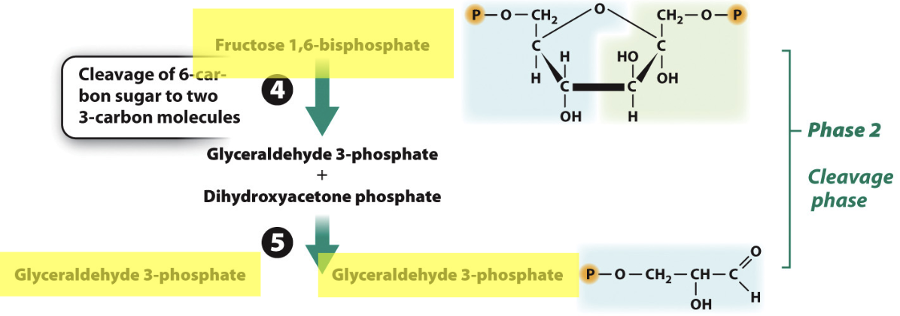

Phase 3

- Payoff phase
- Production of 4 ATP and 2 NADH

Products of Glycolysis
$$4 ATP - 2 ATP = 2 ATP \text{ (net gain)}$$
$$2 NADH$$
$$2 Pyruvate$$

### Pyruvate Oxidation

Pyruvate is oxidized to acetyle-CoA, connecting glycolysis to the citric acid cycle

- The pyruvate is transported into the mitochondrial matrix from the cytosol
- Then converted to acetyle-CoA within the mitochondria
  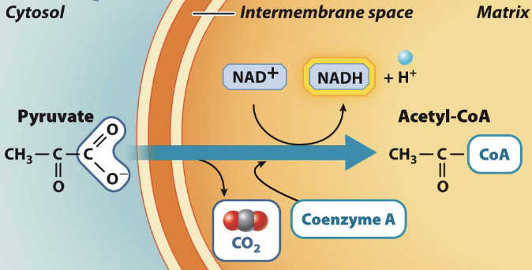

Products of Pyruvate Oxidation
$$2 \times 1 CO_2$$
$$2 \times 1 NADH$$
$$2 \times 1 \text{Acetyle-CoA}$$

### Citric Acid Cycle

Results in the complete oxidation of fuel molecules and the generation of ATP and reduced electron carriers

- The citric acid cycle is known as the **Kreb's cycle** and the **TCA cycle**
- Takes place in mitochondrial matrix
- Fuel molecules are completely oxidiezed in this stage

Products of Citric Acid Cycle

$$2 \times 1 ATP$$
$$2 \times 3 NADH$$
$$2 \times 1 FADH_2$$
$$2 \times 2 CO_2$$

### Electron Transport Chain

Transfers electrons from electron carriers to oxygen, using the energy released to pump protons and synthesize ATP by oxidative phosphorylation

- Electrons in NADH enter the ETC via complex I
- Electrons in FADH2 enter the ETC via complex II

Electron transport
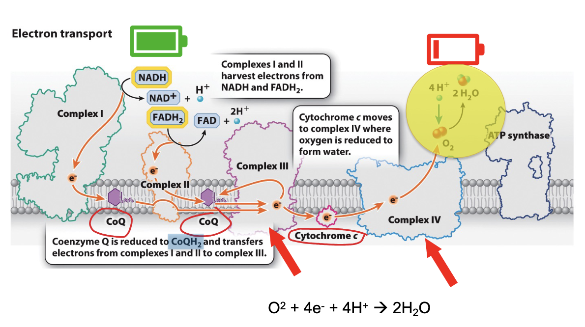

Proton transport and ATP synthesis

- The proton gradient has two components
  - A chemical gradient resulting from the different concentration of hydrogen ions
  - An electrical radient resulting from the difference in charge between the two sides

ATP Synthase

- The rotation of the $F_0$ subunit -> roation of the $F_1$ subunit
- The rotation of the $F_1$ subunit -> conformational changes that allow it to catalyze the synthesis of ATP

## Cellular Respiration II

Core Concepts

1. **Anaerobic Metabolism**: breakdown of glucose through fermentation, produces a modest amount of ATP
2. **Fermentation**: a process for extracting energy from fuel molecules without relying on oxygen or ETC, use an organic molecule
3. **Metabolic Integration**: metabolic pathways are integrated, allowing control of the energy level of cells

The Flow of Energy in Cellular Respiration

- 4 ATP produced by substrate-level phosphorylation per glucose
- Some energy transferred to 10 NADH and 2 FADH2 per glucose
- ATP Synthase converts the gradient to rotational energy to produce 28 ATP per glucose

### Anaerobic Metabolism

- breakdown of glucose through fermentation, produces a modest amount of ATP

### Fermentation

- a process for extracting energy from fuel molecules without relying on oxygen or ETC, use an organic molecule
- In the absence of oxygen, pyruvate molecules undergo fermentation instead of pyruvate oxidation

Lactic acid Fermentation

- Occur in anaerobic bacteria
- 2 Pyruvate is produced through glycolysis per glucose
- 2 Pyruvate is reduced to 2 lactic acid
- 2 NADH is oxidized to 2 NAD+
- 2 NAD+ is reused to produce 2 ATP in glycolysis
  
- e.g., production of yakult
  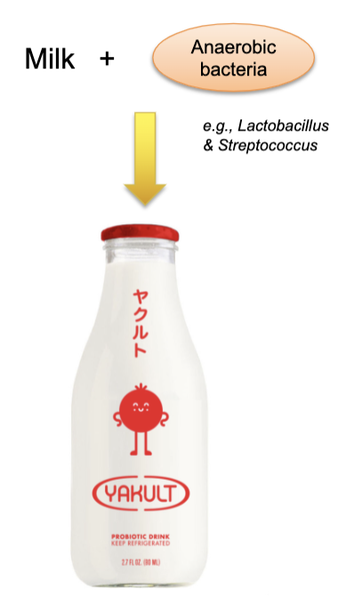

Ethanol Fermentation

- Occur in yeast
- 2 Pyruvate is produced through glycolysis per glucose
- 2 Pyruvate lose 2 CO2 and form 2 Acetaldehyde
- 2 Acetaldehyde is reduced to 2 ethanol
- 2 NADH is oxidized to 2 NAD+
- 2 NAD+ is reused to produce 2 ATP in glycolysis
  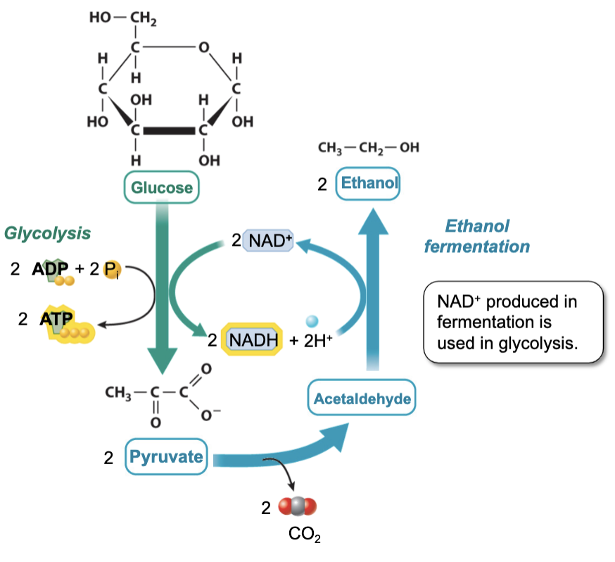
- e.g., wine, beers, bread

Rising Levels of Atmospheric Oxygen

- Before the presence of atmospheric oxygen, the earliest organism used one of the fermentation pathways
- Fermentation provide quick burst of ATP
- Higher efficiency in certain environments

### Metabolic Integration

- Metabolic pathways are integrated, allowing control of the energy level of cells

Glycogen Storage

- Glycogen has a core protein
- A core protein is surrounded by branches of glucose units
- Glycogen is stored in muscle cells -> muscle contraction
- Glycogen is stored in liver cells -> deliver energy and support cells
- Glucose molecules at the end of the branches can be cleaved one at a time
- Cleaved molecule is converted from glucose 1-phosphate to glucose 6-phosphate to undergo glycolysis

How other Sugars contribute to Glycolysis

- Monosaccharide, Disaccharide
  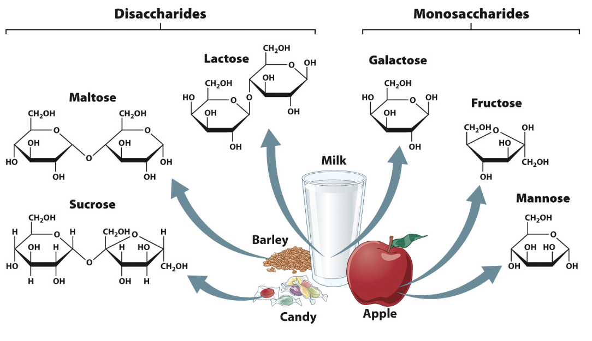
- Polysaccharide
  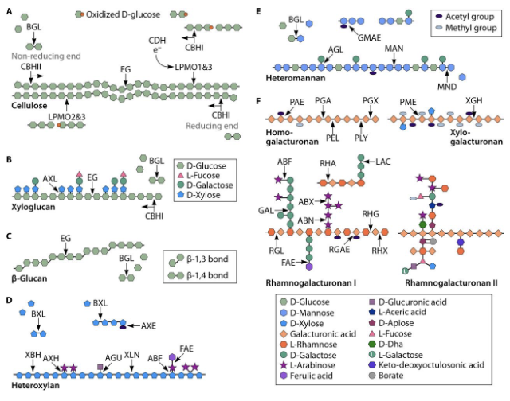

Ruminants and Microbes

- Ruminants do not have an enzyme to digest cellulose
- Rumens of herbivore ruminants are colonized by
  - Bacteria
  - Archaea
  - Fungi
  - Bacteriophages
- Microbes living in the rumen of the ruminants degrade cellulose

Evolution of Mitochondria

- Some eukaryotes lack mitochondria, possess **mitosome** instead
  

Hydrogenosomes in Anaerobic Fungi

- Hydrogenosomes are H2-producing mitochondrial homologs found in some anaerobic microbial eukarytoes
- Hydrogenosomes (H) are small (~0.5 um diameter)
- Spherical or variously elongate organelles

Regulation of Cellular Respiration
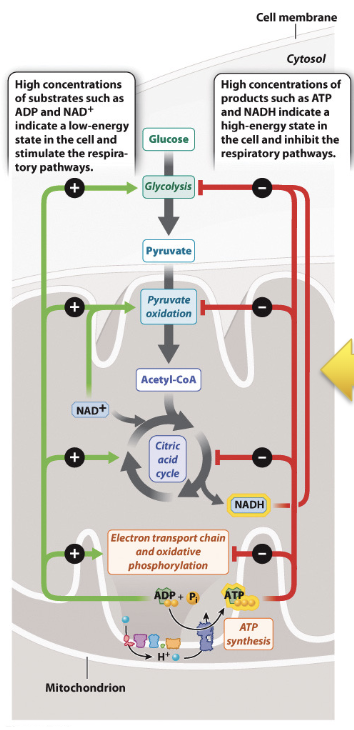

## Photosynthesis I

Core Concepts:

1. **Photosynthesis**: the major pathway by which energy and carbon are incorporated into carbohydrates
2. **The Calvin Cycle**: a three-step process that synthesizes carbohydrates from carbon dioxide
3. **Capturing Sunlight into Chemical Forms**: the light-harvesting reactions that use sunlight to produce the ATP and NADPH required by the Calvin Cycle

### Photosynthesis

- the major pathway by which energy and carbon are incorporated into carbohydrates

Energy in Biological Systems

- Photosynthesis provides an entry point to the majority of energy

Survival in Diverse Environment

- In desert, photosynthesis bacteria and unicellular algae form an easily disturbed layor on the surface (**desert crust**)
  
- Some live in extreme environment e.g., hot spring, glacier

Uncommon Photosynthetic Players

- _Nostoc sp._: example of a symbiosis
  
- _Geosiphon pyriforme_
  
- Lichen: fungi + algae/cyanobacteria
  - Multiple fungal elements can be involved
    

General Equation for Photosynthesis
$$CO_2 + H_2O \rightarrow C_6H_{12}O_6 + O_2$$

- Type of a reaction
- Oxidation of water is linked with the reduction of carbon dioxide
- Series of redox reaction to oxidize water make up the **photosynthetic electron transport chain**

Photosystem

- Photosynthesis begins with the absorption of light by protein-pigment complexes (**photosystems**)
- Absorbed light is used to drive redox reactions
- The movement of electrons through the chain is used to drive the synthesis of ATP and NADPH
- ATP and NADPH are the energy sources required for Calvin cycle

The Chloroplast

- Thylakoid membranes form structures that resemble flattened sacs, grouped into grana
  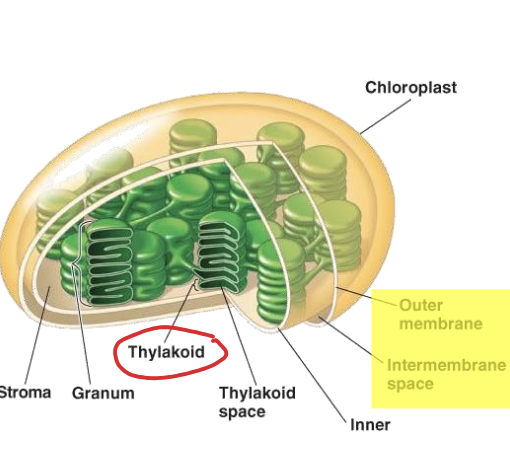

Cellular Respiration vs. Photosynthesis

- Notice that the reactions are the opposite of one another
- Photosynthesis generates fuel molecules (by fixing carbons)

### The Calvin Cycle

- a three-step process that synthesizes carbohydrates from carbon dioxide

Three steps

1. Carboxylation: addition of CO2 to the 5-carbon compound, RuBP (done by **rubisco**)

- 6-carbon molecule is broken down into two 3-carbon molecules, **3-PGA**

2. Reduction: energy input form ATP and NADPH

- **NADPH** is the reducing agent
- The reduction of 3-PGA requires ATP and NADPH

3. Regeneration of RuBP: 3-carbon compounds are reorganized and combined to produce RuBP

- $$5\times 3C \rightarrow 3 \times 5C$$

Energy Storage

- Excessively produced glucose is stored as starch granules

### Sunlight into Chemical Forms

- the light-harvesting reactions that use sunlight to produce the ATP and NADPH required by the Calvin Cycle

Light Absorption

- Light is a type of electromagnetic radiation
- Pigments absorb some wavelegths of visible light
- Pigments look colored as they reflect light enriched in the wavelengths that they do not absorb
  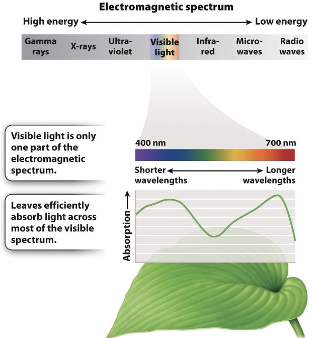

Chlorophyll Light Absorption

- Chlorophyll appears green as it poorly absorbs green wavelengths
- Chlorophyll molecules are bound by their tail region to integral membrane proteins in the thylakoid membrane
- Hydrocarbon tail anchors the chlorophyll to cell
  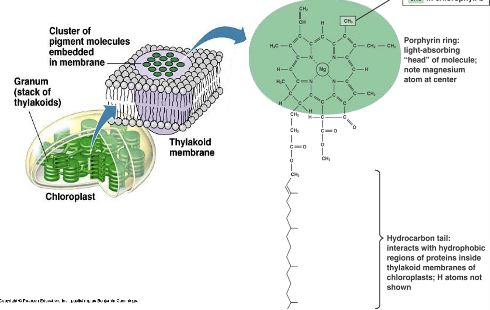
- Light energy is absorbed through chlorophyll in an electorns and sent to reaction center

Reaction Center

- Possess distinct configuration
- Transfer energy to the electron acceptor

## Photosynthesis II

Core Concepts

1. **Photosynthesis Challenge**: challenges to the efficiency of photosynthesis include excess light energy and the oxygenase activity of rubisco
2. **The evolution of photosynthesis**: a profound impact on life on Earth

### Photosynthesis Challenge

Reaction Center
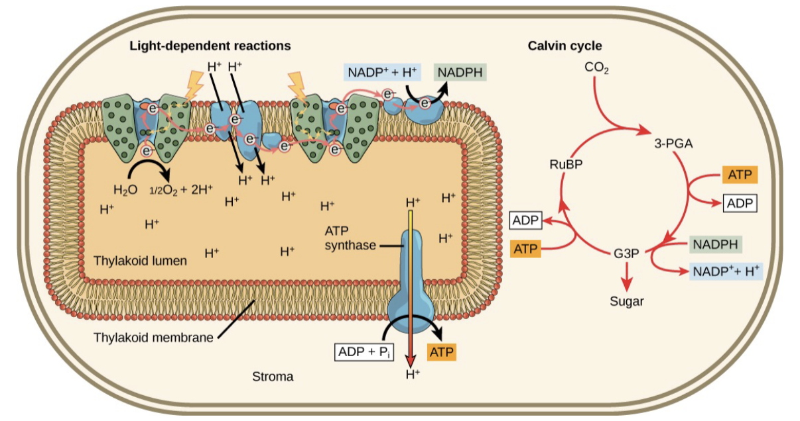

Two Photosystems
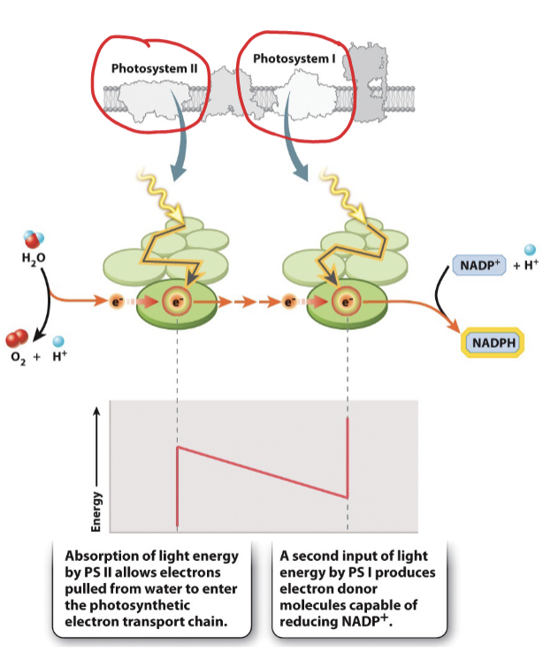

- **Z Scheme** describes change in energy level of the electron as it goes through the photosystems
- **PS II** supplies electrons to the beginning of the ETC
- **PS I** energizes the electrons with a second input of energy -> provide enough energy to reduce NADP+
- **Electron carriers** (e.g., Pq, Pc, Fd) are responsible for moving electrons between complexes
  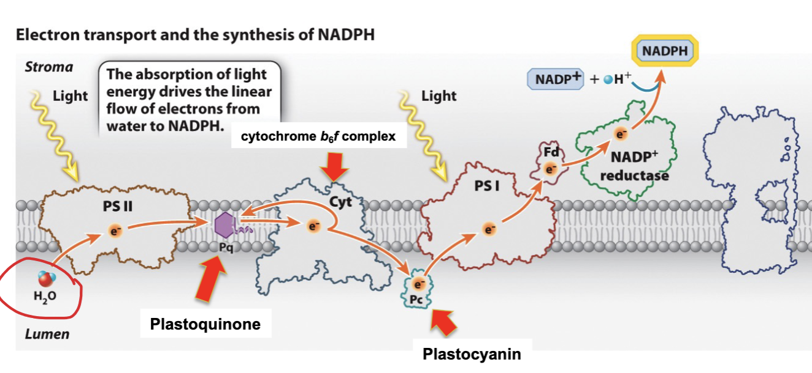

Proton Accumulation

- There are two sources of options
  - Through **water oxidation**
  - Through the **cytochrome b6f complex**
    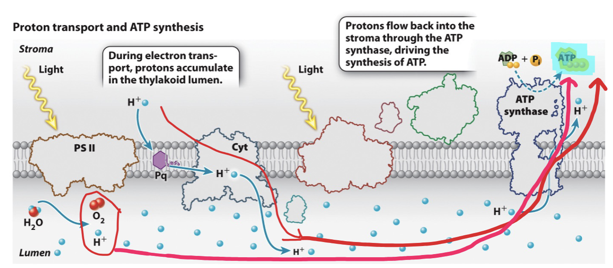

Cyclic Electron Transport

- To increase ATP production, electrons are shunted into an alternative pathway via **ferredoxin** (Fd)
- Result in pumping more protons
  

#### Photosynthesis Challenge I: excess light energy

- If the light density is too high, the high-energy electrons will lose a safe place to go
- Increased change to create **Reactive Oxygen Species** (ROS)

Reactive Oxygen Species

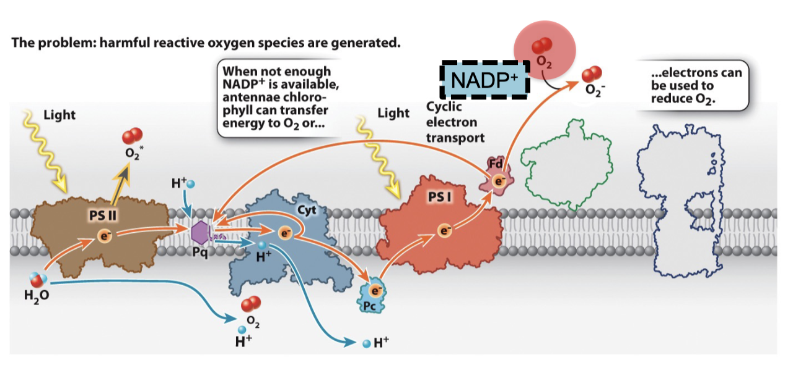

- Releases harmful free radical
- NADP+ is in short supply
- -> Either the absorbed light energy or the energy associated electron can be transferred to O2
- -> Formation of ROS
- Antioxidants can neutralize ROS
- Xanthophylls can slow the formation of ROS
  - By reducing excess light energy
  - Yellow-orange pigmenst

#### Photosynthetic Challenge II: the oxygenase activity of rubisco

- Photorespiration occurs when rubisco adds O2 instead of CO2 to RuBP (rubisco accepts both as substrates)
- Photorespiration can be reduced through C4 cycle (e.g., Corn)
  - Increase CO2 concentration
  - PEP carboxylase synthesizes 4-C molecules
  - CO2 is passed to the bundle-sheath cell, where the Calvin cycle occurs

Photosynthetic Efficiency

-Efficiency of \<4%

Cell-free Solar-to-starch Efficiency

- Perfom photosynthesis in lab
- Efficiency of 9%

### The evolution of photosynthesis

Step 1: two phosotytems
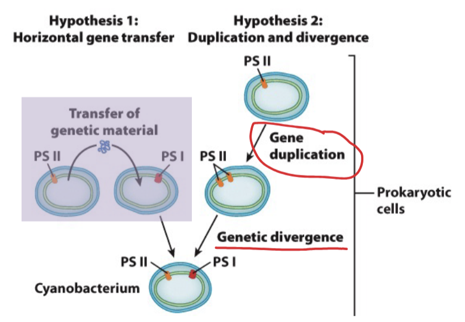

Step 2: endosymbiosis

Horizontal Gene Transfer (HGT)

Methods prevalent in Prokaryotes

- **Conjugation**
  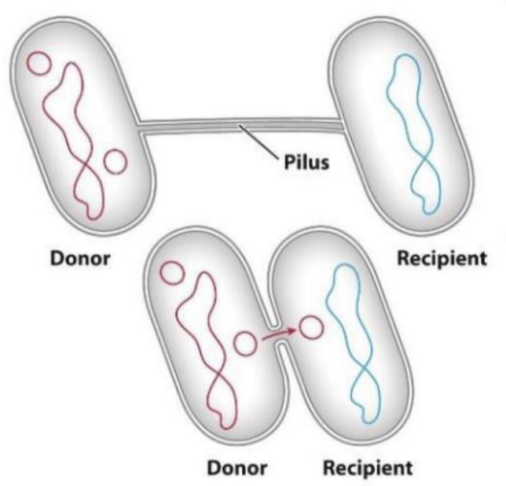
  - DNA from a donor cell is transferred to an adjacent recipient cell
  - Pilus tethers the donor to the recipient
  - Bring the cells together
  - Once closely aligned, DNA passes through the small opening formed
  - e.g., genes that confer resistence to antibiotics
- **Transformation**
  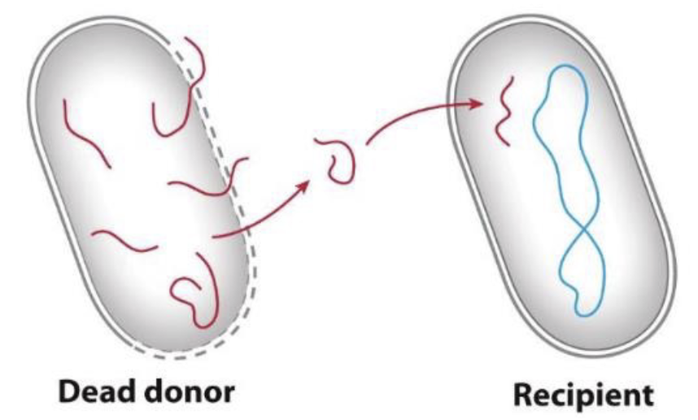
  - DNA is released to the environment by dead cells and taken up by a recipient cell
- **Transduction**
  
  - Transfer by a virus
  - Viruses that have infected bacterial cells can integrate their DNA into the host bacterial cell
  - Before leaving the bacterial host, the viral DNA removes itself
  - Sometimes removal of viral DNA involves the additional takeup of the host DNA

HGT between Eukaryotes

- HGT of Carotenoid genes from fungi to Aphids
- HGT of ubiquitine genes from insects to fungi

Note: ghost plant cannto photosynthesize -> steal from fungi
Note: red maple leaves still can perform photosynthesis through other yellow/brown coloured pigments

## Cell Cycle

Core Concepts

1. During **cell division**, a single parental cell divides into two daughter cells
2. **Mitotic cell division** is the basis of asexual reproduction in unicellular eukaryotes and the process by which cells divide in multicellular eukaryotes
3. **Meiotic cell division** is essential for sexual reproduction, the production of offspring that combine genetic material from two Integral_Peripheral_Membrane_Proteins

### Cell Division

- A single parent cell divides into two daughter cells
- The process by which cells make more cells
- Purpose
  - Growth
  - Cell replacement
  - Healing
  - reproduction
- Requirements
  - Two daughter cells must each receive the full complement of genetic material present in the single parent cell
  - The parent cell must be large enough to divide into two and still contribute sufficient cytoplasmic components to each daughter cell

#### Prokaryotes

Binary Fission

1. The circular bacterial DNA molecule is attached by proteins to the inner membrane
2. DNA replication begins at a specific location and proceeds bidirectionally around the circle
3. The newly synthesized DNA molecule is also attached to the inner membrane, near the attachment site of the initial molecule.
4. As replication proceeds, the cell elongates symmetrically around the midpoint, separateing the DNA attachment sites.
5. Cell division behinds with th synthesis of new membrane and wall material at the midpoint
6. Continuted synthesis completes the constriction and separates the dauther cells
   
   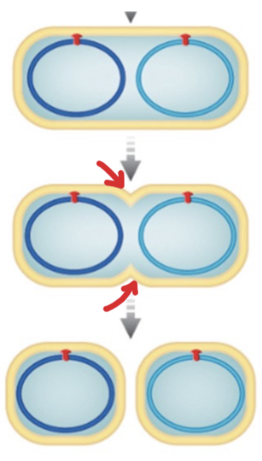

| Eukaryotes                 | Prokaryotes                  |
| -------------------------- | ---------------------------- |
| Genome is large and linear | Genome is small and circular |
| DNA found in the nucleus   | DNA found in the cytoplasm   |

Cell Cycle (Eukaryotes)

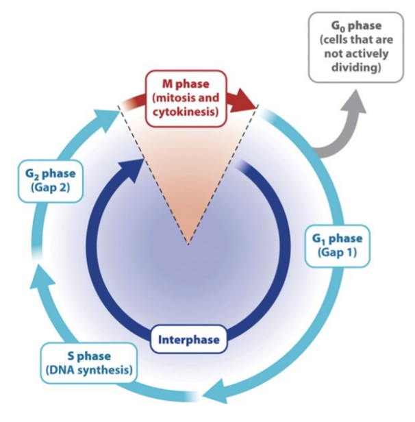

- **M phase**: time during which the parent cell divides into two daughter cells
- **Interphase**: time between two successive M phases
  - Cells make many preparations for division
  - e.g., replication of DNA and increase in the cell size

Eukaryotic DNA Organization

- DNA is organized with histones and other proteins into chromatin
- Chromatin can be looped and packaged to form chromosomes

Karyotype

- Profile of the chromosomes in a certain species
  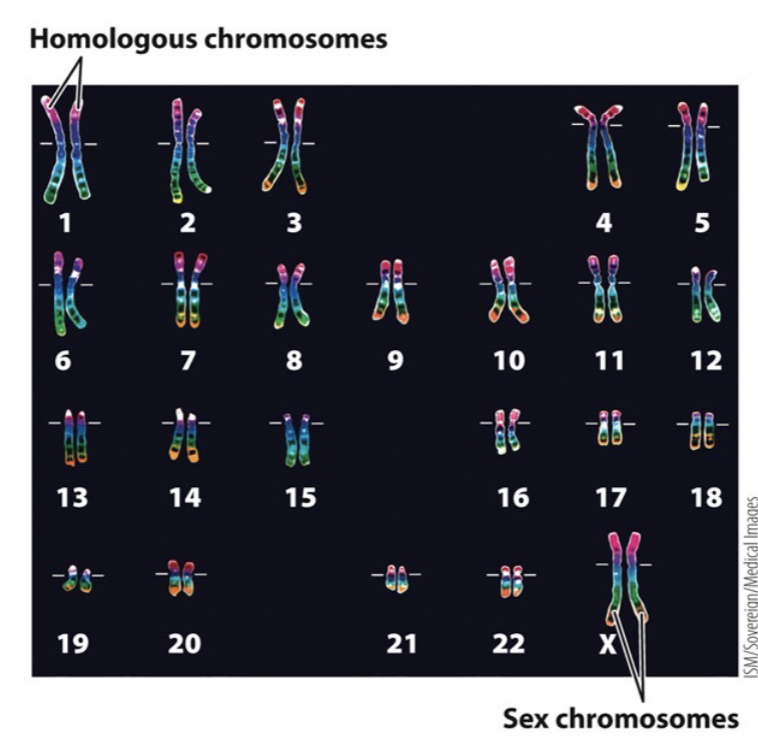

Haploid/Diploid

- Haploid: cells with a single set of chromosomes e.g, human gametes
- Diploid: cells with paired chromosomes

Centromeres/Chromatids

- Note that the sister chromatids are analogous to each other as they are duplicated

### Mitotic Cell Division

- The basis of asexual reproduction in unicellular eukaryotes and the process by which cells divide in multicellular eukaryotes

#### Prophase

- Chromosomes condense
- Centrosomes radiate microtubules and migrate to opposite poles

#### Prometaphase

- Mitrotubules of the mitotic spindle attach to chromosomes

#### Metaphase

- Chromosomes align in center of cell

#### Anaphase

- Sister chromatids separate and travel to opposite poles

#### Telophase

- Nuclear envelope re-forms
- Chromosomes decondense
- The end of mitosis

#### Cytokineses (Animal)

- **Contractile ring** forms to divide and cleave the cytoplasm

#### Cytokineses (Plant)

- **Cell plate** forms to divide the cytoplasm

### Meiotic Cell Division

- Essential for sexual reproduction, the production of offspring that combine gneetic mateirla from two parents
- Meiosis I, homologous chromosomes separate
- Meiosis II, sister chromatids separate
- Results in four daughter cells
- Each daughter cell contains a half number of chromosomes as in the parent cell
- Each daughter cell is genetically unique

#### Meiosis I

- **Reductional division** as the number of chromosomes in daughter cells are reduced by half
- the centromeres do not split during this stage of meiosis

#### Prophase I

- Chromosomes become visible as thin threads (DNA replication is complete)
- Homologous chromosomes condense, undergo synapsis (gene-for-gene pairing)
- Each pair of homologous chromosomes forms a bivalent (each chromosome consists of two sister chromatids)
- Chromosomes shorten and thicken
- Nuclear envelope break down

#### Crossing Over

- Meiosis allows homologous chromosomes of maternal and paternal origin to undergo an exchange of DNA sements
- Contribute to the genetic variation
- Crossing over also helpes hold together the bivalents for metaphase I
  

#### Prometaphase I

- Spindles attach to kinetochores on chromosomes

#### Metaphase I

- Homologous pairs line up in center of cell, with bivalents oriented randomly with respect to each other
- Contribute to the genetic variation

#### Anaphase I

- Homologous chromosomes separate, but sister chromatids do not

#### Telophase I

- Reformation of nucleus envlope

#### Cytokinesis

- Separation of cytoplasm

#### Meiosis II

- The process resembles mitosis except phrophase II (have haploid, not diploid)
- No DNA synthesis between two meiotic divisions
- Meiosis II is called **equational division** because cells in meiosis II have the same number of chromosomes in the beginning and in the end

Mitosis vs. Meiosis

- During meiosis I, maternal and paternal homologs separate from each other
- During meiosis II, sister chromatids separate from each other (similar to mitosis)

Cytoplasmic Division

- In females, the cytoplasm is divided very unequally in both meiotic divisions to form an egg
- In males, the cytoplasm divides fairly equally, resulting in products of functional sperms
  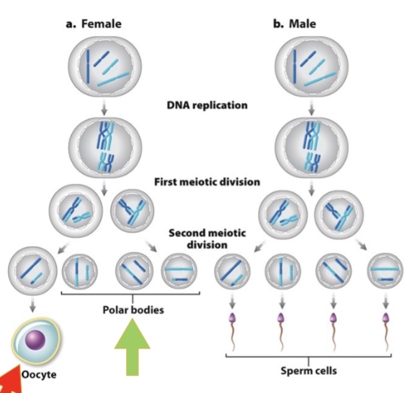
  Note that the original number of chrosomomes (2n) is restored through the formation of zygote as a result of combination between Oocyte and a sperm cell

## Regulation of Cell Cycle and Cancer

Core Concepts

1. **Nondisjunction** results in extra or missing chromosomes
2. **Cell cycle regulation**: the cell cycle is regulated so that cell division occurs only at appropriate times and places
3. **Cancer** is uncontrolled cell division that results from mutations in genes that control cell division

### Nondisjunction

- results in extra or missing chromosomes

First-division

- Result in gametes with an extra or missing chromosome
  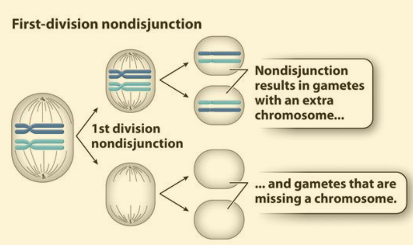

Second-division

- REsults in gametes with an extra chromosome, a missing chromosome, and normal numbers of chromosomes
  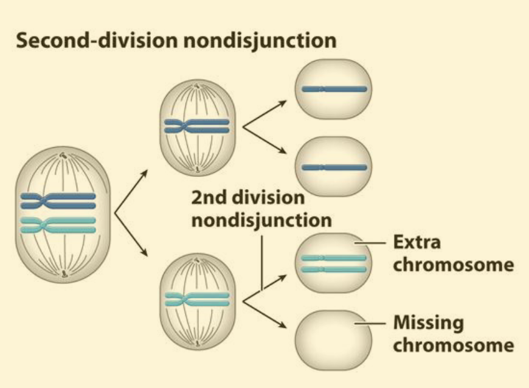

Trisomy 21: Down Syndrome

- Three 21 chromosomes present

Nondisjunction in species with different reproduction strategies
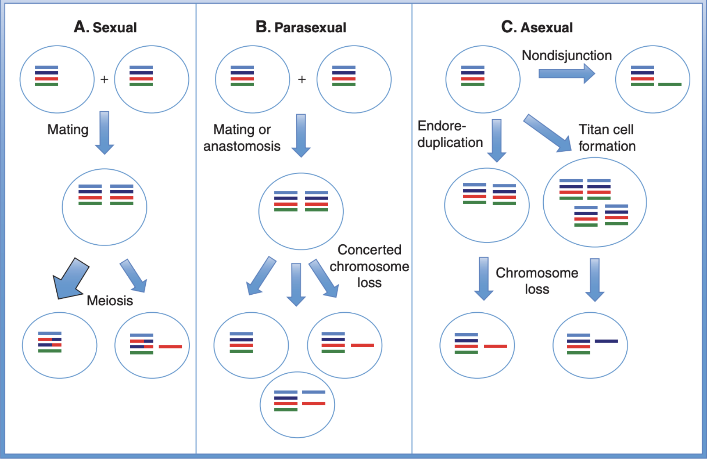

### Cell cycle regulation

- The cell cycle is regulated so that cell division only occurs when and where appropriate

Regulation

- Cell division cannot occur all the time because uncontrolled division is dangerous and can lead to cancer
- The proteins that appear and disappear cyclically are called **cyclins**
  
- Enzymes activated by cyclins are called **cyclin-dependent kinases (CDK)**
- Once the CDK are activated by cyclins, cell division is promoted

Cyclin level through the Cell Cycle
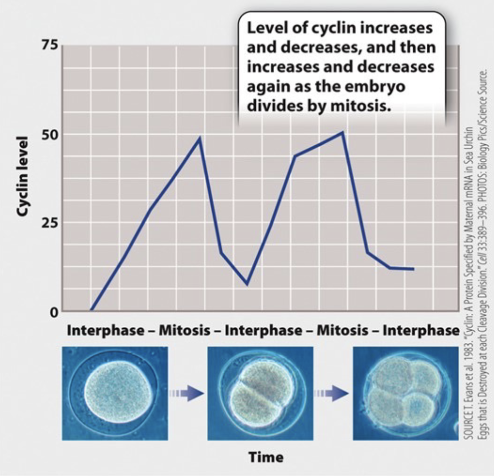

Cyclin-CDK Complexes

- Cyciln D and E -CDK are actie at the end of G1
  - Promotes the expression of histone proteins
- Cyclin A-CDK is involved in the initiation of DNA synthesis
  - Prevents the reassembling of the same proteins and re-replicating the same DNA
- Cycling B-CDK, initiates multiple events associated with mitosis
  - Breakdown of the nuclear envelope during prophase
  - Formation of mitotic spindles
    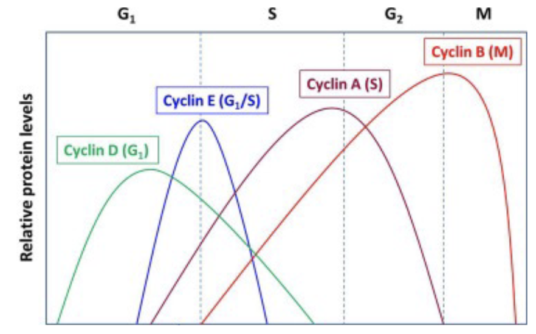

Checkpoints

DNA Damage Checkpoints

- This arrests the cell at the G1/S transition, giving the cell time to repair the DNA damange

### Cancer

- uncontrolled cell division that results form mutations in genes that control cell division
  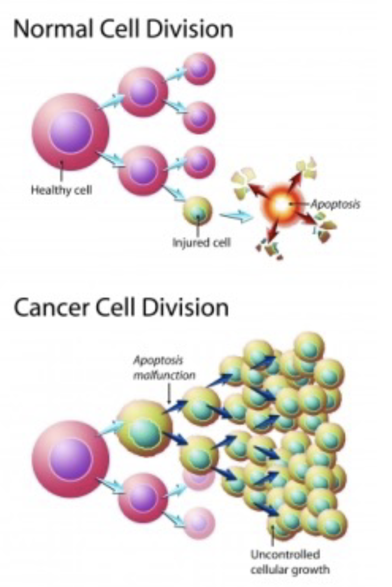

Cancer and oncogenes

- **Proto-oncogenes**: normal genes that are important in cell division that have the potential to become cancerous if mutated (can be mutated by cancer-causing agents)
- **Oncogene**: cancer-causing gene
- **Tumor suppressors**: encode proteins whose normal activities inhibit cell division

Cancer causing agents

- Virus
  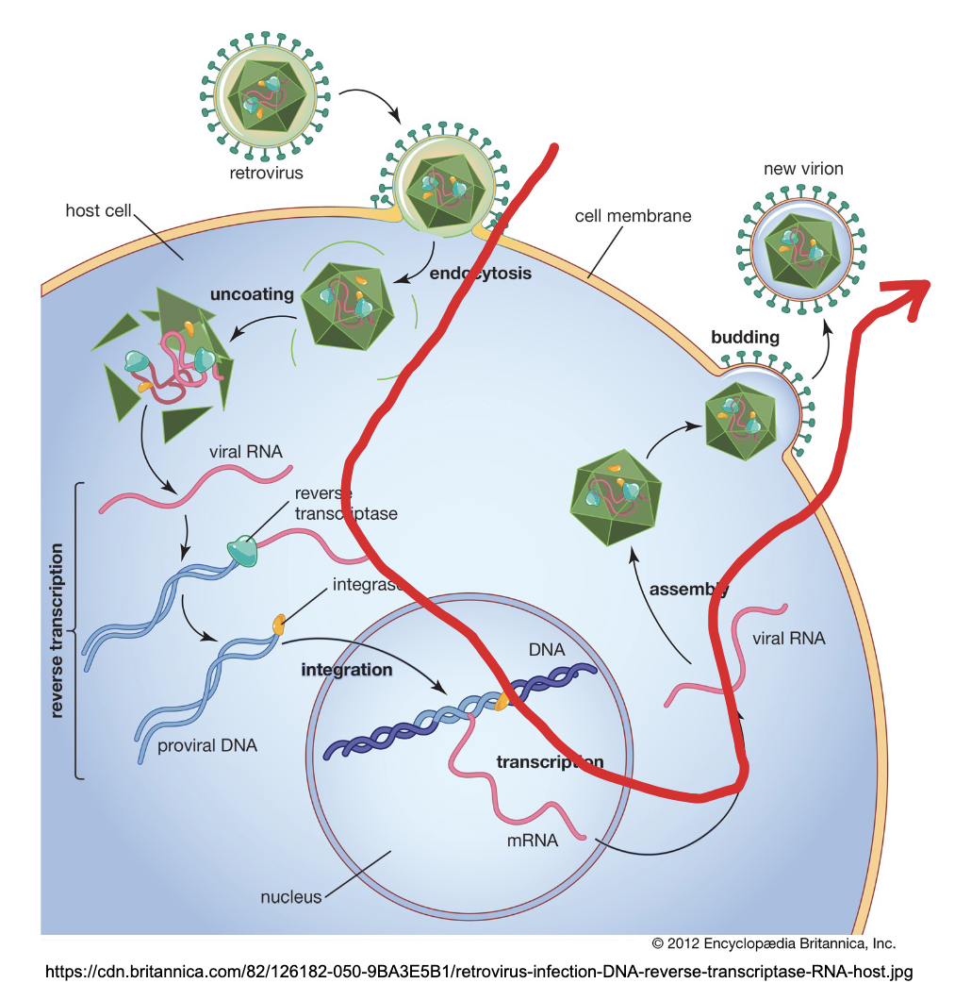
  - Cancerous viral RNA is injected to the host genome
- Pathogens
  
  - Helicobactor Pylori is a cancer-causing bacteria
  - HBV, HCV, and HPV are cancer-causing virus

Multiple-Mutation Model for Cancer Development

Types of Cancer Treatment

- Hormone therapy
- Surgery
- Bone Marrow Transplantation
- Chemotherapy
- Targeted theraphy
- Radiation therapy
- Immunotherapy
- Note that cancer is difficult to treat as it begins from healthy cells -> challenge is to selectively kill the affected cells

Fungus, Cordycepin, NUC-7738

- Cordycepin inhibits DEK

Medicinal mushroms

- The Jack-o-Lantern fungus is bioluminescent (the glow "foxfire")
- Poisonous but the source of a new cancer drug in clinical trials

CRISPR (Clustered Regularly Interspaced Short Palindromic Repeats)

- CRISPR can be used to fight against cancer
  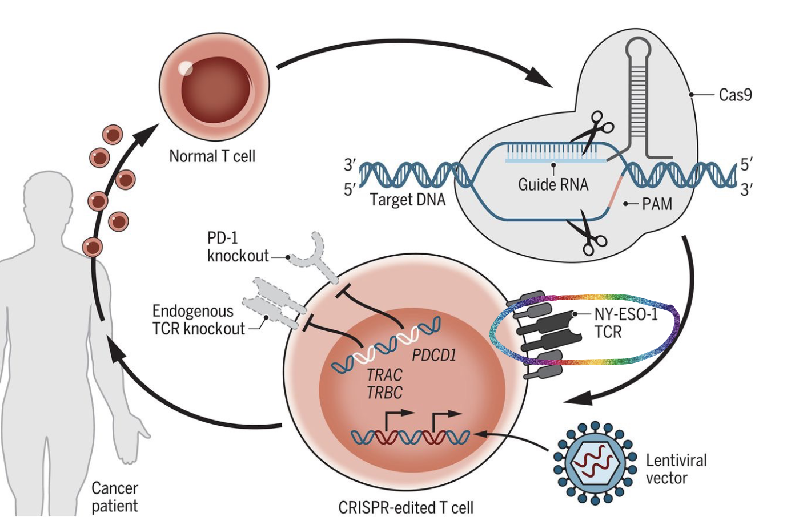
- Modify the T-cells with CRISPR
  -NY-ESO-1 TCR precisely recognizes the cancer cell

Comparison of Mitosis and Meiosis
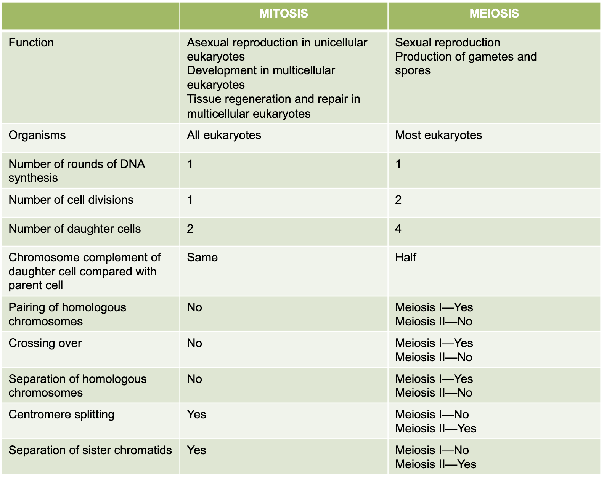

## Fungal Cells

Core Concepts

1. FUngi are **heterotrophic eukaryotes** that feed by absorption
2. Fungi reproduces both **sexually and asexually**, and disperse by **spores**

### Fungi

- Fungi are responsible for
  - the **decomposition** of plants and animal tissues
  - locate and break down the complex molecules and bulky tissues
  - **cycle carbon**
- **Heterotrophs**: depend on pre-existing organic molecules for carbon and energy
- Release enzymes to break down complex organic molecules e.g., starch, cellulose, and lignin
- Absorb the digested organic molecules directly through their cell walls

#### Fungal Hyphae

- Most fungi are multicellular
- Consist of highly branched filaments, **hyphae**
- No mode of locomotion
- Use growth to find nourishment
- **Mycelium**: a network of branching hyphae

Hyphal Growth
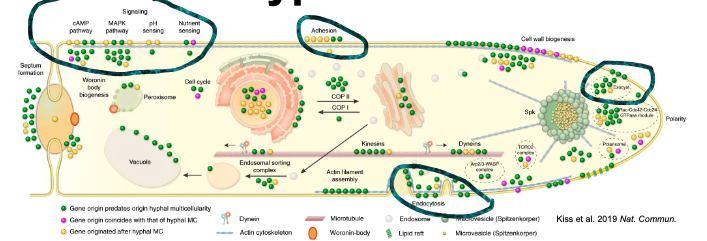

#### Material Transport

- Cell walls are made of **chitin**, the same compound found in the exoskeleton of insects
- Can transport **food** and **signaling molecules** across long distances in **mycelia**, driven by changes in **turgor pressure**
- Differences in turgor pressure along hyphae drive bulk flow (similar to phloem transport)
  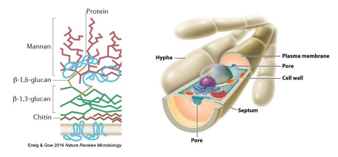
  - Allows hyphae to use materials in nutrient-rich locations to fuel hyphal elongation across nutrient-poor locations
- In some early-diverging groups, the hyphae have many nuclei but no cell walls to separate them
- In more advanced groups, nuclear divisions are accompanied by the formation of **septa**, walls partially divide the cytoplasm into separate cells

#### Septa variation

- Plugs are developed to regulate the nutrient flow
  

#### Yeast

- **Yeasts** are single-celled fungi
- Foundin moist nutrient-rich environments
- Divide by budding
  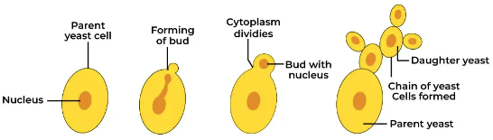
- Common on the surface of plants, and to a lesser extent on the surfaces and in the gut of animals

#### Decomposition

- Most fungi use dead organic matter as their source of energy and raw materials
- Bacteria and some protists can also subsist on dead organic matter but it is mostly fungi that decompose them back to carbon dioxide and water

#### Fungal Infections in Living Tissues

- Plants are vulnerable to a diverse array of fungal pathogens
  - e.g., rusts, smuts, and molds that cause huge losses in agricultural production
- Aboveground, infection is transmitted by fungal spores
- Belowground, infection is transmitted by hyphae that penetrate the root

#### Fungal Infections in Invertebrates

- Insects and other invertebrates are susceptible to fungal pathogens

#### Fungal Infections in Vertebrates

- Rare in vertebrates
- Severe infections are more frequent among fish and amphibians than in mammals

#### Fungus as a pathogen

- Mucormycosis caused a fungal disease (Mucorales)
- It is difficult for the fungi to meet the virulence factors
  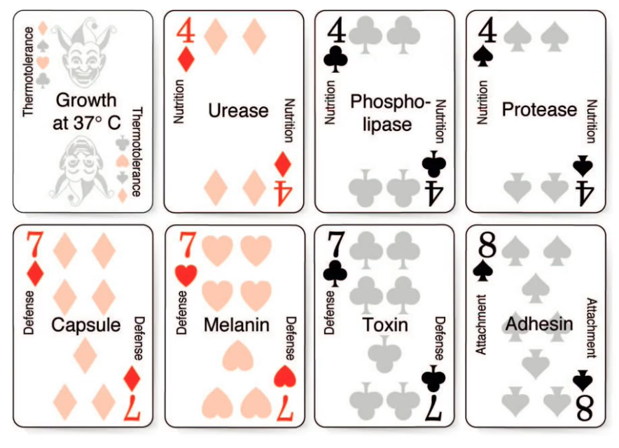

#### Mutualistic Relationships (Mycorrhizal)

- Mycorrhizal fungi suuply plant roots with nutrients e.g., phosphorus from the soil
- In return, receives carbohydrates from their host
- Two main types: **ectomycorrhiza**, **endomycorrhiza**
  
- Ectomycorrhiza fungi do not penetrate
- Endomycorrhiza (Arbuscular mycorrhiza) penetrate into the root cells and produce **arbuscules** -> increase surface area for exchange of materials

#### Mutualistic Relationships (Endophytes)

- Fungi called endophytes live within leaves and grow within cell walls and in the spaces between cells -> mutualistic
- The insects provide the fungi with shelter, food, and protection from predators and pathogens
- Fungi are used as a food source for the insect

#### Mutualistic Relationships (Lichens)

- **Lichens** are associations between fungi and photosynthetic microorganisms e.g., green algae, cyanobacteria -> mutualistic
  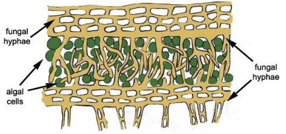
- The hyphae anchor the lichen to a rock or tree, aid in the uptake and retention of water and nutrients
- The photosynthetic partners provide a source of reduced carbon e.g., carbohydrates
- Cyanobacteria living in lichens provide a source of nitrogen e.g., ammonia
- Fungi and photosynthetic microorganisms exchange nutrients through fungal hyphae that tightly encircle or event penetrate the walls of the photosynthetic cells
- Lichens spread asexually by
  - Fragmentation
  - The formation of dispersal units consisting of a single photosynthetic cell surrounded by hyphae
    

### Spore Dispersal

- Fungi face two challenges in completing their life cycles:
  - Maintaining genetic diversity: must find other individuals to mate with
  - Dispersal: must be able to disperse from one place to another
- The probability of any given spore landing on a favourable habitat is low -> produce huge number of spores
- Spores allow fungi to use resources that are patchy in time and in space

#### Asexual Spore Dispersal

- A moldy pieces of bread reveals that the surface is covered with **hyphae** carrying **sporangia** containing asexual spores
- In many species, asexual spores are produced within sporangia that form at the ends of erect hyphae, facilitating the release of the spores into the air

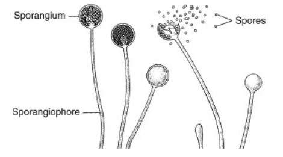

Fruiting bodies

- Some fungi rely on external agents such as raindrops or animals to move their spores around

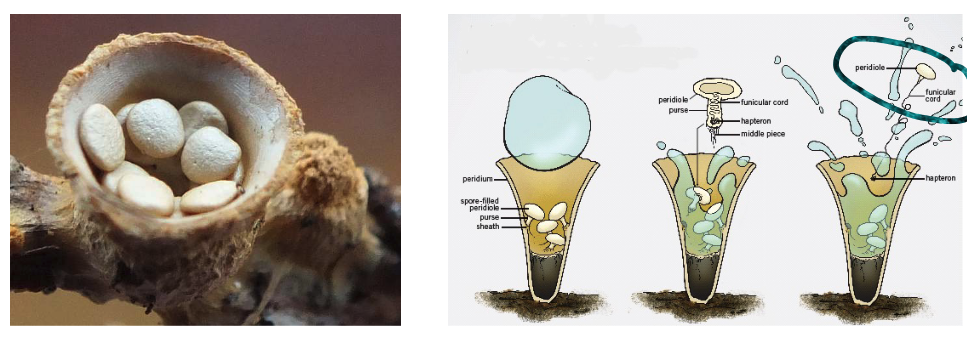

#### Fungal Life Cycle

- In most fungi, the sexual phase of the life cycle involves the fusion of hyphal tips rather than specialized reproductive cells, or gametes
- In fungi, the fusion of haploid cells is not immediately followed by the fusion of their nuclei
- Haploid nuclei retain their independent identities, resulting in a **heterokaryotic** stage
- The cytoplasmic union of two cells (**plasmogamy**) is not always followed immediately by the fusion of their nuclei (**karyogamy**)
  

#### Parasexual Cycle

- **Parasexual** fungal species lack an observable sexual cycle
- Use another mechanism of generating genetic diversity
  - The crossing over of DNA during mitosis
- The haploid chromosome number is restored not by meiotic division, but by the progressive loss of chromosomes
- The key difference is that parasexual species do not undergo meiosis
  

## Fungal Diversity

Core Concept

- Other than animals, fungi are the most diverse group of eukaryotes

Fungal Phylogeny
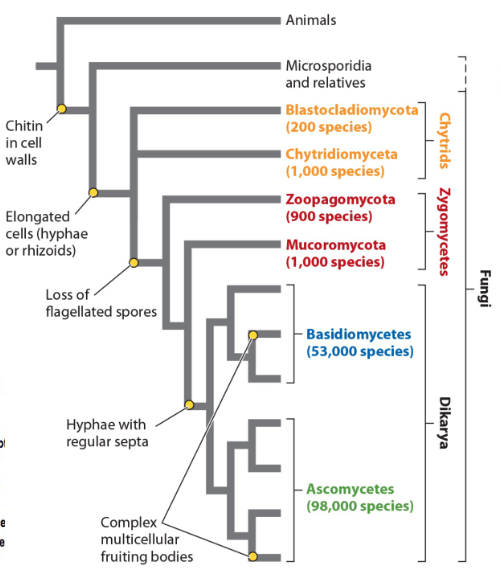

### Chytrids

- Most chytrids are decomposers
- A few are pathogens of algae or vascular plants
- Many chytrids are single cells with walls or chitin
- Chytrids do not form a true mycelium

### Zygomycetes (Zoopagomycota + Mucoromycota)

#### Zoopagomycota

- Constitutes the earliest zygomycetes
- Contains species that are primarily parasites and pathogens of small animals and other fungi i.e., mycoparasites
- _Orphella_:
  

#### Mucoromycota

- Characterized by plant associations and plant-based ecologies
  - Mycorrhizae
  - Root endophytes
  - Decomposers
- _Pilobolus_: can forcibly eject the entire sporangium rather than releasing individual spores
  
- Fungal Highway _Mucor_: promote the growth of bacteria, mucorales species impact human beings beneficially through their use in food industry
- _Glomeromycetes_: a monophyletic group within Mucoromycota
  - Almost all occur in association with plant roots with tremendous ecological importance

#### Dikarya

- Key feature: every mitotic division is accompanied by the formation of a new septum
- Allows fungi to control the number of nuclei within each cell
- Proliferate in the dikaryotic state
- Contains two monophyletic subgroups:

  - Ascomycetes: meiosis is followed by a single round of mitosis, resulting in **asci** that contain eight haploid dspores
  - Basidiomycetes: fruiting bodies
    - Life cycle is similar to that of ascomycetes with some exceptions
      - fruiting body entirely made up of dikaryotic hyphae
      - nuclear fusion takes place in a specialized cell called a **basidium**
      - haploid products of meiosis do not undergo mitosis
      - **Clamp formation**: ensure that each cell is dikaryotic
    - Live by forming ectomycorrhizal associations or by decomposing wood and other substrates
    - The multicellular fruiting bodies produced by some fungi facilitate the dispersal of sexually produced spores
    - Fruiting bodies are highly ordered and compact structures compared to the mycelia from which they grow

- A novel floral mimicry system by _Fusarium_ fungi
  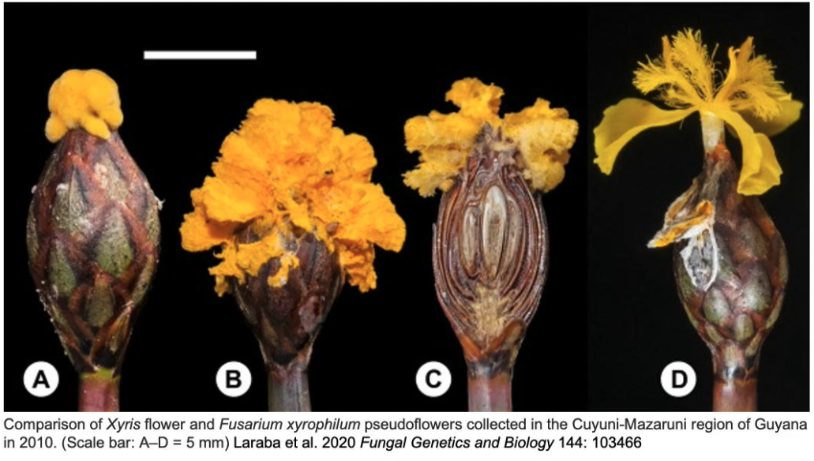
- Here, only D is a healthy flower

## Terminologies

**hypertonic**: having a lower concentration of solute

**hypotonic**: having a higher concentration of solute

**mutualist**: a type of relationship between the host and symbiont where both organisms benefit and no one is harmed

**commensal**: a type of relationsip between the host and symbiontwhere one species obtains food or other benefits from the other without harming or benefiting the latter
