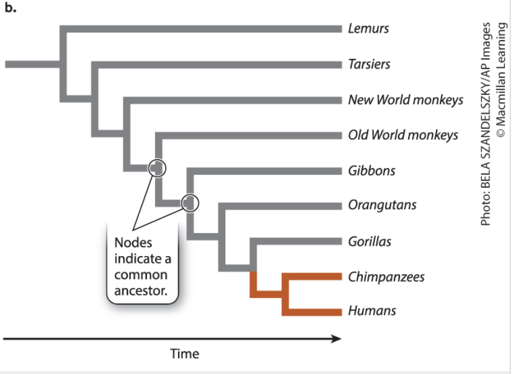
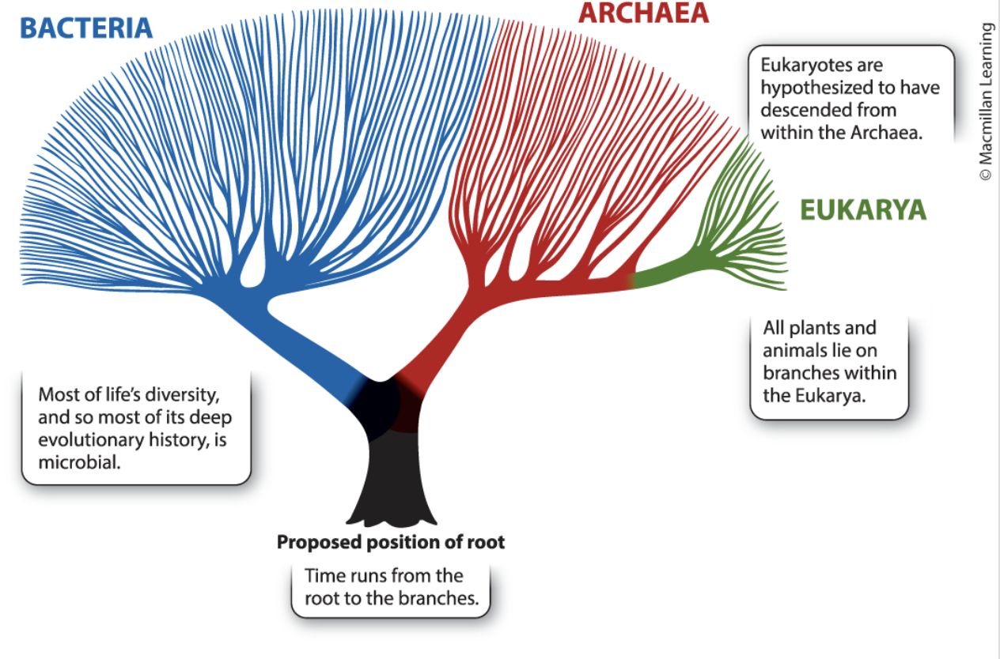
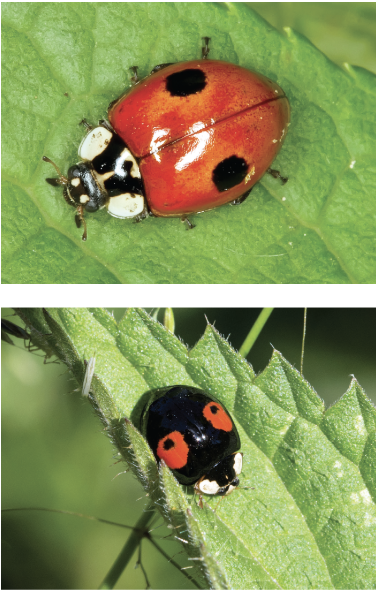
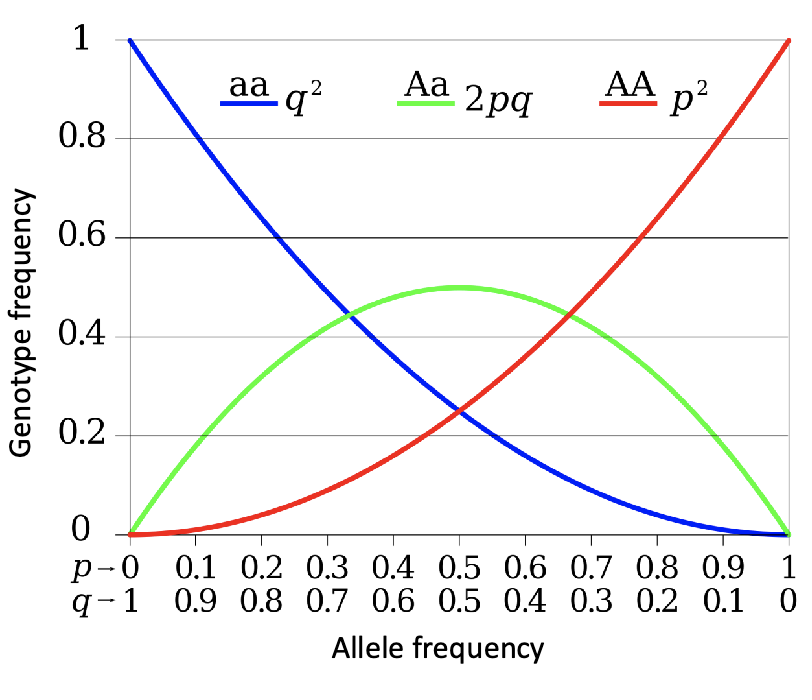
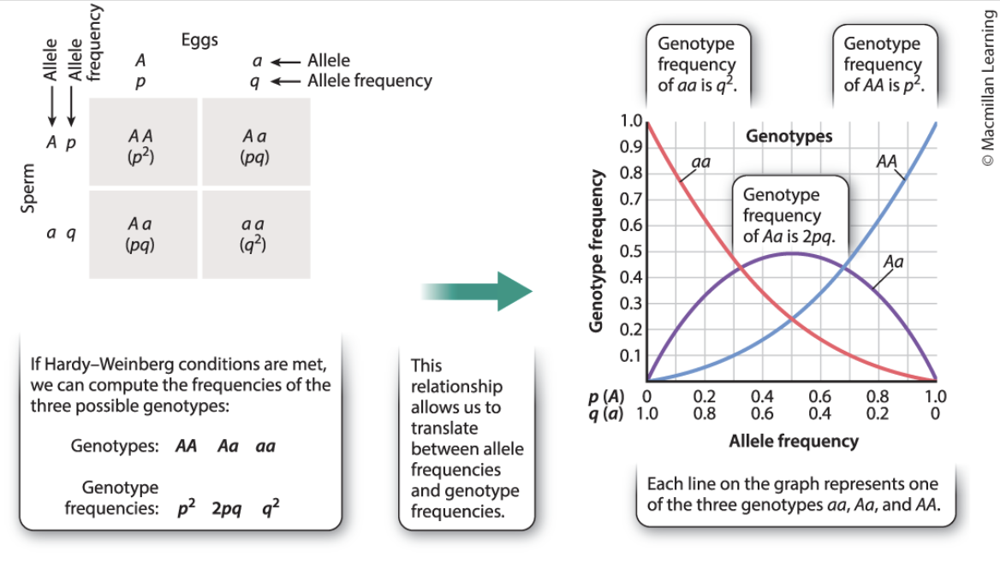
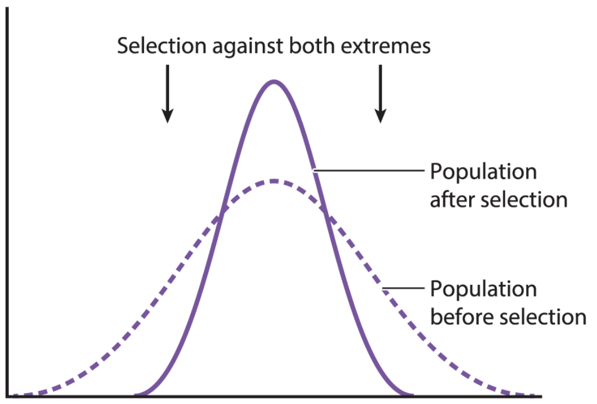
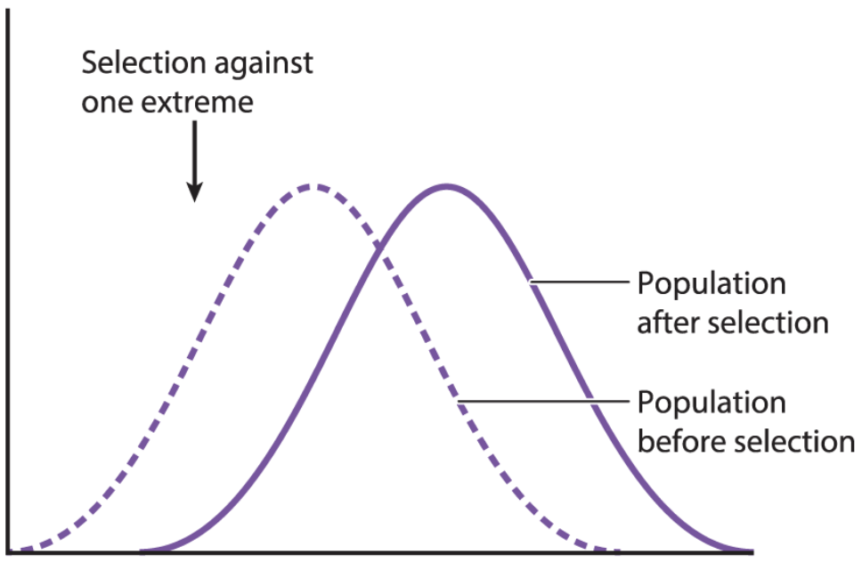
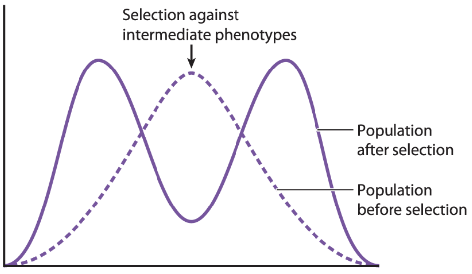

+++
title = '1. Evolution'
draft = false
toc = true
math = true
bold = true
+++

Life displays great diversity with 10 million or more species. The unity and the diversity of life are explained by **evolution**.

## Introduction to Evolution

### Variation in Populations

#### Why is Variation Beneficial for Evolution?

- Variation in populations plays a key role in **natural selection**
- **Natural seletion** depicts that the variants with characteristics that are best applicable for an environment in terms of **growth and reproduction** will contribute the most to the next generation. e.g.
  - Farmers choosing seeds with high yield and resistency to drought and disease
  - Breeders developing different breeds of dogs e.g. terriors, huskies (Selection under domestication)
  - Rise in antibiotic resistance of disease-causing microorganisms

#### How does Variation Occur?

1. **Environmental Selection**

- Occurs due to differences in the environment e.g.
  - Exposure to sunlight
  - Exposure to female codling moth (its egg develops into a caterpillar and eats its way into the fruit)

2. **Genetic Variation**

- Occurs due to differences in the genetic material e.g.
  - Types of apples with different tastes and color (green Granny Smith, yellow Golden Delicious, scarlet Red Delicious)
  - Individual apples within a tree (due to unique combinations of genes through fertilizaion process)
- Stems from genetic **mutations**
- **Mutations** arise from:
  1. Random errors when passing genetic materials i.e. during DNA replication
  2. Environmental factors e.g. UV radiation, cigarette smoke
- Harmful variations die out overtime
- Beneficial veriations thrive
- Neither can persist overtime

### Evolutionary Trees

- Evolution can be illustrated using a tree diagram as following. Branches represent different groups or organisms and nodes indicate the most recent common ancestor
  
- **Tree of Life**: the full set of evolutionary relationships along all organisms
  
- Most branches on the tree of life consist of microorganisms
- Despite that the tree shows the origin of eukarya to be archaea, biologists think it is derived by symbiosis between an archaeon and a bacterium
- The order of life-forms is determined by fossils

### Evolution through Experiments

#### Can Evolution be Demonstrated in the Laboratory?

- Background: In 1988, the biologist Richard Lenski grew _E.Coli_ on a medium with imited amounts of glucose to observe whether they improve on their ability to metabolize glucose.

- Hypothesis: Any bacterium wiht a random mutation that increases its ability to take up glucose will reproduct at a faster rate than the other, thereby demonstrating evolution in a bacterial population.

- Experiment: Cells of _E.Coli_ are frozen at -80°C are kept suspended in animation, surviving without any biological processes. Starting bacteria are labeled **Ancestral** and the bacterial populations taken from the environment with limiting amounts, every 500 generations, of glucose were labeled **Descendant**. Then, compared the rate of growth of these two populations.

- Results: The growth rate of the **Descendant** bacterial populations became much steeper than the rate of the **Ancestral** in the given environment.

- Conclusion: This experiment demonstrates that _E.Coli_ evolved an improved ability to metabolize glucose overtime.

- Follow-up: Later studies discovered differences in genetic makeup between **Ancestral** and **Descendant** bacterial populations.

- Application: Development of beneficial strains of microorganisms. e.g.
  - Removing toxins from lakes and rivers
  - Understand how pathogens develop resistance to drugs

## Genetic Variation

In spite of a high degree of phenotypic variation, humans rank low in terms of overall genetic variation. Humans differ from each other by 1 DNA base per 1000 (99.9% identical), whereas fruit flies differ by 10 DNA bases per 1000 (99% identical).

Note that both genotype and environment contribute to the phenotype of an individual, which makes it hard for us to compare genetic variation directly. We can achieve this through DNA sequencing.

### Population Genetics

#### What is a species?

- A group of individuals that are capable of sharing alleles
- Each individual represents different combinations of alleles drawn from the [gene pool](#gene-pool)

#### What is Population Genetics?

- The study of genetic variation in natural [populations](#populations)
- This discipline answers the following questions:
  - Which factors determine the amount of variation in a population and in a species?
  - Why are humans genetically less variable than fruit flies?
  - Which factors affect the distribution of particular variations?

### Sources of Genetic Variation

1. **Mutation**: generates new alleles

   Mutation by effective range

   - **Somatic mutation**: occur in the body's tissues in nonreproductive cells
     - Only affects one individual
     - e.g. skin cancer due to somatic mutation is not inherited
   - **Germ-line mutation**: occur in the reproductive cells i.g. sperms, eggs
     - Appear in every cell of an offspring

   Mutation by effects on an organism

   - **Neutral mutation**: despite every human naturally having around 60 new mutations, most of them have little to no effect as a large part of genome consists of noncoding DNA
   - **Deleterious mutation**: most of mutations occuring in protein-coding regions have a harmful effect
   - **Advantageous mutation**: delivers a beneficial effect, rarely occurs

2. **Recombination**: shuffles mutations and generates new permutations, followed by segregation of homologous chromosomes during meiotic cell division

## Measuring Genetic Variation

The goal of **population genetics** is to **infer the evolutionary process** from patterns of genetic variation in nature. Thus, the rates of occurrence of alleles in populations play a key role.

### Allele Frequencies

#### What is Allele Frequency?

- The **allele frequency** of an allele _x_ is the number of _x_'s present in the population divided by the total number of alleles e.g.
  - Given 50% _aa_, 25% _Aa_, 25% _AA_, an allele frequency of _a_ is $$(2 \times 50) + 25 = 125, \frac{125}{200}=62.5\%$$
    an allele frequency of _A_ is
    $$25 + (2 \times 25) = 75, \frac{75}{200}=37.5\%$$
    Note that the denominator is $200$ as pea plant is diploid

### Measurments of Genotype and Allele Frequencies

#### Observable Traits

- Measurment through observable traits is possible if phenotype = genotype
- Rarely observed due to large number of encoding genes for a trait and because not only genotypes, but also environment affects phenotypes
- Until 1960s, we were only able to study phenotypes that are encoded by a single gene e.g. ABO blood group, colouring of two-spot ladybug _Adalia bipuncatata_
  

#### Gel Electrophoresis

- **Gel Electrophoresis** separates segments of proteins according to their charge and their size
- An individual with **heterozygotic** mutation that eventually alters a protein will produce two distinct bands in the gel
- Limiation: can detect only mutations that alter protein structures

#### DNA Sequencing

- Capable to detect **silent mutations**
- How to:
  1. Collect a population sample
  2. Count the number of occurrences of a given mutation
- e.g. Consider single nucleotide [polymorphism](#polymorphism)

## Evolution and Hardy-Weinberg Equilibrium

### Evolution

#### What is Evolution?

- **Evolution** is a change in the frequency of an allele or a genotype throughout generations. Note evolution can occur without a change in allele frequency if genotype frequency changes
  > Populations evolve, not individuals

### Hardy-Weignberg Equilibrium

#### When does evolution come to halt?

- Changes do not occur once **Hardy-Weinberg equilibrium** is reached
- **Hardy-Weignberg equilibrium** specifies the relationship between [alleleFrequencies](#allele-frequency) and [genotypeFrequencies](#genotype-frequency) when the following conditions are met:
  1. **No Nautral Selection**: No difference in the survival and reproductive success of individuals with different genotypes e.g. Given _a_ is a [lethal](#lethal) recessive mutation, all _aa_ individuals will die -> decrease in frequency of _a_ allele -> increase in frequency of _A_ allele, representing the survival success
  2. **Infinite Population**: this equilibrium holds only for infinitely large populations to neglect [genetic](#genetic-drift) [drift](#genetic-drift)
  3. **No Gene Flow**: Populations are not added to or subtracted from by migration
  4. **No Mutations**: e.g. If _A_ alleles mutate into _a_ alleles, there still exist changes in genetic makeup
  5. **Indiscriminate Mating**: mate choice made regardless of genotype

#### Hardy-Weignberg Principle

- To ask whether a population is evolving, we can first determine what the genetic makeup of the population would look like if it were not evolving at that locus
- **Null model** can be compared with a real population
  

#### Example of genotype frequencies

- Hypothesis: **Hardy-Weinberg equillibrium** has met
- Consider 70 _A_ alleles and 30 _a_ alleles. Then,
  $$\mathbb{P}(\text{AA homozygote})=0.7 \times 0.7 = 0.49$$
  $$\mathbb{P}(\text{Aa heterozygote})=(0.7 \times 0.3) + (0.3 \times 0.7)=0.21 + 0.21 = 0.42$$
  $$\mathbb{P}(\text{aa homozyote})=0.3 \times 0.3 = 0.09$$

#### Generalization of frequency prediction

- Suppose Hardy-Weignberg conditions are met (no change in allele and genotype frequencies). Let

  - $p=\text{frequency of } A$
  - $q=\text{frequency of } a$
  - $p+q=1$ (normalization)
    
    Then we can predict the genotype frequencies in the next generation as the following:
    $$\mathbb{P}(\text{AA})=p^2$$
    $$\mathbb{P}(\text{Aa})=2pq$$
    $$\mathbb{P}(\text{aa})=q^2$$

- Even if Hardy-Weignberg conditions are not met, allele frequencies can be determined given genotype frequencies e.g. $\text{frequency of }A=p=\sqrt{p^2}=\sqrt{\mathbb{P}(AA)}$

#### Significance of Hardy-Weignberg equillibrium

- When it is upheld, it provides a means of converting between allele and genotype frequencies
- When it is not upheld, we can infer that evolution has occured in that population (further investigation is required to find the mechanism behind it)

## Natural Selection

- Deterious mutations are eliminated and have no long-term evolutionary impact
- Advantageous mutations result in adaptation to the environment over time

### Adaptation

#### Relation between Adaptation and Natural Selection

- Darwin explained adaptation through natural selection
- Through _On the Origin of Species_ in 1859 by Darwin brought both evolution and natural selection to public attention

### Fitness

#### What is Fitness?

- **Fitness** is a **relative** measure of the ability of an individual to survive and reproduct in a particular environment
- i.e. the extent to which the individual's genotype is represented in the next generation
- e.g. Consider a gazelle that runs 25 kph. In a [herd](#herd) of gazelle with 20 kph, this one has a high fitness. In a herd of gazelle with 30 kph, this one has low fitness.

#### Relation between Fitness and Natural Selection

- Natural selection over generations increases the overall fitness of a population

### Types of Natural Selections

#### Positive vs Negative

- **Positive Selection**: natural selection that increases the frequency of an advantegous allele
- **Negative Selection**: natural selection that decreases the frequency of a deletrious allele
- Human genetic disease still arises as recessive alleles are not completely eliminated through natural selection

#### Balancing Selection

- **Balancing Selection**: natural selection that acts to maintain two or more alleles of a given gene in a population
- e.g. [heterozygote](#heterozygote-advantage) [advantage](#heterozygote-advantage) illustrated by human populations in Africa affected by malaria: a heterozygote _AS_ with _A_, a normal hemoglobin allele and _S_, a sickle-cell allele is preferred as sickle-cells are effective at fighting for malaria but also can be fatal if excessive due to capillary blockage

#### Modes of Selection

- **Stabilizing Selection**: maintains the status quo and acts against extremes e.g. human birth weight: fatal if a baby is very small or very big
  
- **Directional Selection**: a form of selection that results in a shift of the mean value of a trait in a population over time e.g. size of bills of the birds
  
  **Artificial Selection** is a form of directional selection
- **Disruptive Selection**: a form of selection that operates in favour of extremes and against intermediate forms, selecting against the mean e.g. Apple maggot flies (_Rhagoletis pomonella_): one group feeds on apple trees, the other group on hawthorn trees due to the difference in the timing of fruiting
  

#### Sexual Selection

- **Sexual Selection**: a form of selection that promotes traits that increase an individual's access to reproductive opportunities
  - **Intrasexual Selection**: a form of sexual selection involving interactions between individuals of on sex e.g fighting ability in males to compete other males
  - **Intersexual Selection**: a form of sexual selection involving interaction between males and females e.g. bright colors in males to attract females

## Terminologies

**gene pool**: all the alleles present in all individuals in a population or in a species e.g. alleles for skin colour, hair type, eye colour, etc

**populations**: all the individuals of a given species that live and reproduce in the same geograhpical area; one of several interbreeding groups of organisms of the same species living in the same geographical area

**polymorphism**: variable nucleotide positions

**lethal**: sufficient to cause death

**genetic drift**: a random change in the frequency of an allele due to the statistical effects of finite population size

**allele frequency**: commonndess or rarity of each allele in the gene pool assuming individuals are diploid and both gametes contribute to the production of offspring

**herd**: a social group of certain animals of the same species

**heterozygote advantage**: a form of balancing selection in which the heterozygote's fitness is higher than that of either of the homozygotes resulting in selection that ensures that both alleles remain in the population at intermediate frequencies
