+++
title = '1. Evolution'
draft = false
toc = true
math = true
bold = true
+++

Life displays great diversity with 10 million or more species. The unity and the diversity of life are explained by **evolution**.

## Introduction to Evolution

### What is Evolution?

Basic Definition:

- Change through time
- Decent with motification
- Darwin's "Pangenesis": proposal that each part of the body continually emits small particles called gemmules that contribute to the heritable information to the gametes

**Biological** Definition:

- Change in allele or genotype frequencies in populations over time

Note:

- Evolution occurs in **populations**
- Evolution **does not** occur in an individual

### Adaptive Radiation

- Organism diversify rapidly from an acestral species when a change in the environment makes new resources available, creates new challenges, or opens new environmental [niche](#niche)
- e.g. Hawaiian Drosophila radiation: alleles and genotypes of Drosophila shift through times as volcanic islands form, are observed through phenotypes, and evolve by natural selection

### How does Evolution affect our lives?

**Penicillin**

- Product of _Penicillium_ mold (Alexander Fleming, 1928)
- Represents an evolved response to bacteria
- First antibiotic drug based on a naturally occuring substance
- Four years of of use -> _Staphylococcus_ strains resistant went up to 14%
- By 1950, resistant became more than 50%

**Penicillin: today**

- Continue to develop new strains of penicillin
- Identify and locate resistance
- Need to minimize dependence on antibiotics
- Resistant bacteria still kills 30,000 to 40,000 Americans each year

**COVID-19**

- Mutations lead to variations, which can exceptionally be problematic
- Properties of variants: [virulence](#virulence), dispersal, symptoms

### Micro vs Macro

**Microevolution**

- Changes within a species
- Caused by natural selection or evolutionary forces
- Depends on heritable variation in genetics of a [population](#population)
- **Traits** can be under strong natural selection e.g. antibiotic resistance

**Macroevolution**

- Changes between species

## Microevolution

### Phenotypic Variation

Heritable variation in appearance and/or function

- **Qualitative variation**:

  - Discrete characteristics
  - **Polymorphism**: distinct variatns of character
  - e.g. two-spot ladybug

- **Quantitative variation**:
  - Continuous and measurable characteristics
  - Controlled by multiple genes
  - e.g. height

Examples of Phenotypic Variation

- European Garden Snails vary in colour as there is no selective pressure acting on it. In a hypothetical situation, the population can converge towards a brown-coloured snails if the predators evolve to detect the bright colours better.
- Bahamian Land Snails are under a strong selective pressure, having only a few, non-distinguishable phenotypic variation.

Factors of the Phenotypic Variation

- Phenotypic variation is due to **genetics (genotype)**, **environment**, or **both**
- Only genetic component of phenotype are heritable

### Phenotypic Variation Experiment

1. Keep Genetics constant (e.g. clone), Vary Environment

- The clour of Hydrangeas vary depending on the pH of soil (acidic: blue, basic: pink)

2. Breeding and Selection

- Important as evolution can only act on heritable variation
- Artificially selected mouse with higher activity level (experimental lines) and compared with control lines (no artificial selection) -> found out that there was underlying genetic variation for activity level
- **Mandelian genetics**

### Genetic Variation

Causes

1. New alleles from mutations
2. Recombination: from crossing over, independent assortment, random fertilization

Types

1. **Germ-line mutations**: occur in the reproductive cells -> inherited
2. **Somatic mutations**: occur in the non-reproductive cells -> does not get inherited

### Population Genetics

The study of patterns in genetic variation in populations

- Individuals within a population must differ genetically for evolution to occur
- Individuals within a population are closely related to each other than members of other populations
- Different populations of the same species may be isolated from each other such that gene flow is rare

**Gene Pool**

- Sum of all alleles at all gene loci in all individuals within a population
- Characterizes a population's genetic makeup
- Used to identify the genotypes and calculate **genotype frequencies**
- Given that species is diploids and have two alleles of each gene, we can calculate **allele frequencies**

## Evolutionary Agents

### Genotypes and Alleles

- **Genotype frequency**: the % of individuals in a population with a specific genotype -> shows the distribution of allele combinations in a population
- **Allele frequency**: the % of all copies of a certain gene in a population that carry a specific allele -> shows the distribution of genetic variation in a population
- Evolution is measured as changes in **allele frequencies** in populations

### Computing Frequencies

Notations
$$p=\text{frequency of one allele}$$
$$q=\text{frequency of another allele}$$
$$p+q=1 \text{ (normalization)}$$

Genotype Frequencies of the Next Genetation

Assuming that the population is in equilibrium for the C locus, we have
$$(p+q)\times(p+q)=p^2+2pq+q^2$$
where
$$p^2= (\text{frequency of }C^RC^R)$$
$$2pq= (\text{frequency of }C^RC^W)$$
$$q^2= (\text{frequency of }C^WC^W)$$

Example

- Conisder **Snapdragons** that exhibit **incomplete dominance** with distinctive phenotype of heterozygotes
- Let $p=0.7, q=0.3$
- Then, expected genotype frequencies in the next generation are
  $$p^2= 0.7 \times 0.7 = 0.49$$
  $$2pq= 2 \times 0.7 \times 0.3 = 0.42$$
  $$q^2= 0.3 \times 0.3 = 0.09$$
- Predicted countings are 490, 420, and 90.
- Actual countings are 410, 423, and 167, respectively
- Thus, we can conclude that one of the Hardy-Weinberg principles is violated and the population is evolving with the selective force towards the $C^W$ allele.

### The Hardy-Weinberg Principle

- **Null model**: assume the absence of evolutionary change and compare it to the real population
- **Hardy-Weinberg Equilibrium**: describes a population where the frequencies of alleles and genotypes remains constant from generation to generation, provided that only Mandelian segregation and recombination of alleles are at work
- The **Hardy-Weinberg Equilibrium** occurs when the following conditions are met:
  1. **No mutation**
  2. **No gene flow**: population is closed to migration from other populations
  3. **Infinite population**
  4. **No natural selection**: all genotypes survive and reproduce equally
  5. **Random mating**: individuals mate randomly with respect to genotypes

### Microevolutionary Agents

1. **Mutation**: a heritable change in DNA -> introduces new genetic variation into population

- Rare event, significant over long time scales
- **Deleterious** or **lethal** mutations are harmful but may persist if recessive
- **Neutral mutations** are neither harmful or helpful e.g. **slient mutation** that does not alter amino acids
- **Advantageous mutations** benefit an organism e.g. novel host adaptation

2. **Gene flow**: change in allele frequencies as individuals join a population and reproduce -> may introduce genetic variation from another population

- may be the movement of individuals e.g. seeds or gametes e.g. pollen

3. **Genetic drift**: random changes in allele frequencies caused by chance events -> reduces genetic variation (can eliminate in small populations)

- **Population bottelneck**: caused by catastrophic factors: diseases, starvation, drought -> reduce genetic variation
- **Founders effect**: migrating population may not have the entire genetic variation of the parent population

4. **Natural selection**: differential survivorship or reproduction of individuals with different genotypes -> one allele may increase in frequency

- **Relative fitness** is the contribution an individual makes to the gene pool of the next generation relative to the contribution of others
- Natural selection can be measured by **fitness**
- **Directional selection**: favours individuals near one end of phenotypic spectrum
- **Stabilizing selection**: favours individuals with intermediate phenotypes
- **Disruptive selection**: favours individuals with extreme phenotypes

5. **Nonrandom mating**: choice of mates based on their phenotypes and genotypes -> does not directly affect allele frequencies but prevent genetic equilibrium

## Variation

### Selection on variation

Example

- Goldenrod gall fly, _Tephritidae_
- Chemically alter the plant stems to produce a larva inside a gall
- Selection factors:
  - A parasitic wasp, _Eurytoma gigantea_, use hormone to find the gall and inject their eggs -> hatches, eats the larvae, steals the protection
    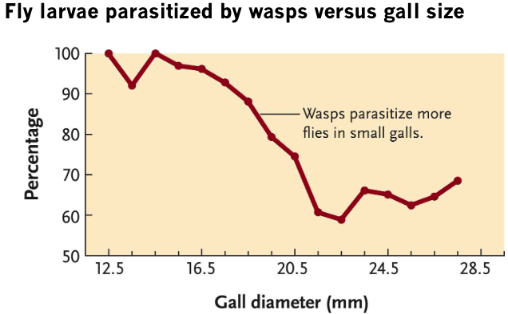
  - Note that larger sized galls are not attacked effectively as a parasitic wasp is small -> selection towards large gall
  - A downy woodpecker, _Picoides pubescens_, is also a predator of the golden gall larvae
    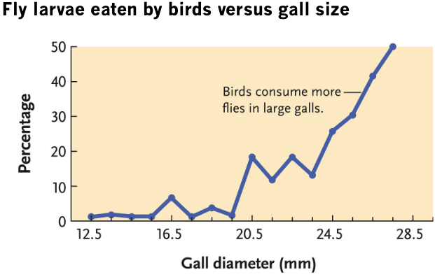
  - Note that large galls are attacked more as the woodpeckers cannot perch on the small galls -> selection towards small gall
- When these two predators are present, stabilizing selection occurs and the gall size converges towards the mean

### Sexual selection

- Competition for mates
- A type of a natural selection

Sexual Cannibalism

- Adaptive male strategy
- Happens if benefits of being eaten > male's expected future reproductive value
- Benefits of being eaten
  - Increased [paternity](#paternity)
  - Decreased likelihood of female remating

Gray Tree Frogs

- Females prefer males with long calls
- Tadpole survival: long call > short call
- Tadpole growth: long call > short call
- Time to [metamorphosis](#metamorphosis): long call < short call

Why is there still variation when selection is so strong?

- Not all females have strong preferences
- Females cannot always mate the "best" male
- Note that relative fitness is not absolute

### Balancing selection

- Various forms of selection that lead to the active maintenance of genetic variation in natural populations
- Alleles are said to be "balanced" when a stable equilibrium state is reached
- If allele frequencies are perturbed from this equilibrium, selection will return them back to that state

Balanced polymorphisms

1. Heterozygote Advantage

a state where heterozygotes are preferred over homozygotes

- Sickle cell anemia and malaria
- Sickled cells clog the arteries but are beneficial at fighting against malaria
- Thus, HbA/Hba heterozygote that produces both normal and sickled forms of hemoglobin is preferred

2. Negative Frequency-dependent Selection

high fitness when rare

- _Perissodus_ are either right-mouthed or left-mouthed
- If right-jawed fish is common, _Perissodus_ evolves to be left-mouthed
- So the fish evolves to be left-jawed, causing _Perissodus_ to evolve right-mouthed

### Adaptation

- **Adaptive traits**: products of selection that increase relative fitness
- **Adaptation**:
  - Accumulation of adaptive traits over time
  - Adaptation hypotheses must be tested
  - Current structures came from existing structures
  - Some traits arise by chance and not selection

### Nautral selection

- Note that natural selection does not necessarily lead to an absolute optimal solution
- Simply prefers a competitive optimum

Why there is no perfect oraganism?

- Selection can only act on existing variation
- Adaptations are often compromises
  - Environments change over time and have competing selection pressures
- Adaptations lag environmental change
  - The traits observed in a population today are the result of natural selection acting in the past
- Chance, natural selection, the environment all interact

## Darwin (Macroevolution)

### Controversy of evolution

- Before Darwin, when **natural theology** was prevalent, it was believed that all organisms are perfectly designed to fit in the environment through God's divine guidance

### Some appreciation that nature changes

- Comparative **morphology** revealed structural similarities in dissimilar anatomies
  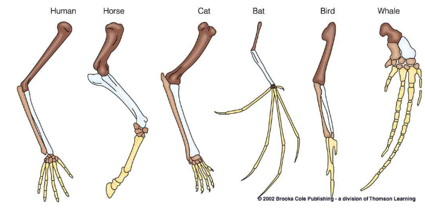
- Currently useless structures, **vestigial structures** were found

### Fossils

Startification

- Horizontal layering of sedimentary rocks
- Different **fossils** in different layers
- Fossils suggested extinction

Paleobiology

- Study of ancient organisms

Catastrophism

- Theory of fossil formation by catastrophe

### Jean-Baptiste Lamarck

Made important contributions to evolution thinking

- Species change over time and pass on changes
- Organisms respond to the environment
- Hypothesized an incorrect mechanism
  - Principle of use and disuse and subsequent inheritance
  - It's not the organism's will, but the environment that takes charge in selection

### Darwin

- Went to medical school but did not like it
- Became friends with a professor **Robert Grant**, who changed from medical school to natural history
- Became friends with a Guyanese taxidermist **John Edmunstone** and learned taxidermy
- Father sent Darwin to Christ's College to become a minister
- Became friends with a professor **John Henslow**, talking about nature -> Suggested Darwin the idea of exploration
- Met **Adam Sedgwick** and became interested in the history of the earth
- Met a captain **Robert Fitzroy** and got on the boat (his father paid)
- **Charles Lyell** encouraged Darwin to make his first publication
- Darwin frustrated by the prevalent idea in the society regarding racism and promoting inequality
- Darwin was discouraged to share his "dangerous idea"
- Darwin's daughter Annie died -> Darwin decided to get his idea out in the world
- Letter from **Alfred Russel Wallace** with the similar idea
- Alfred and Darwin co-authored a paper
- "The Origin of Species" (1859)
  - **Descent with Modification**: fossils of Patagonia as evidence, "principle of succession"
  - **Divergence in Isolation from a Common Ancestor**: each island had similar physical conditions but distinct species of mockingbirds, tortoises, etc
- Darwin believed in **monogenism**, opposing **polygenism** (racial essentialism), but also was a s**sexist**

## Evidence

### Alfred Russel Wallace

- Worked with Darwin
- Activism for environmental issues
- Fire on ship, all specimens lost
- Found the striking pattern in the distribution of animals around the Malay archipelago
- Proposed an imaginary line dividing the region in two parts
- Came to conclusion that the fittest individuals survived and reproduced, passing their advantageous characteristics on to their offspring

### Evolution is a theory

In science:

- Theory is not a guess or a hunch
- Theory is well-established, well-supported, well-documented explanations for our observations

Laws describe, Theories explain

### Macroevolution

Evolution

- **Things evolve**: populations change over time
- **Evolution usually happens gradually**: populations change over hundreds to thousands of years
- **Speciation occurs**: one species splits into two or more species
- **All species share common ancestry**: splitting of lineages from one ancestral form
- **Much of evolutionary change caused by natural selection**: the sole process producing adaptation, the 'appearance' of design

Predictions based on evolution

- If life originated on Earth in the distant past and then evolved, we should see evidence in the fossil record
- If evolution occured within lineages, and those linages sometimes split then we should see change in species or morphology through the fossil record
- If organisms share a common ancestry, then we should see transitional forms
- We should see evidence of [retrodictions](#retrodiction) and vestigial characters
- We should be able to see evidence of **natural selection**
  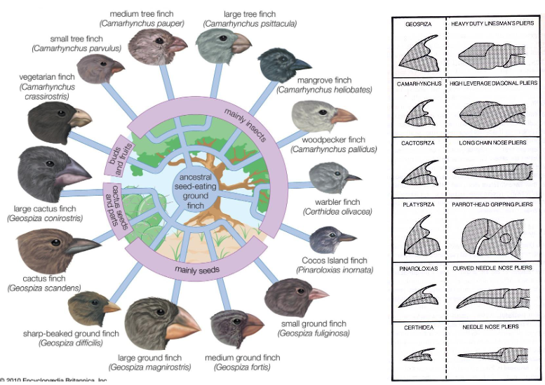

### Peter & Rosemary Grant

- Once professors at McGill, then Princeton
- Long-term fieldwork on the Galapagos Islands
- Natural selection in action

### Peter Boag

- Intended to do a study on the heritability of beak size by swapping eggs to control for parental care

### Finches

Under normal circumstance

- Most finches eat a preferred 24 types of seeds
- G. _fortis_, a medium ground finch and G. _magnirostris_, a large ground finch have the identical preference
- Birds spent ~50% time foraging on their seven favourite seeds
- High abundance of seeds ($10g/m^2$) -> Less selection via competition

After a massive drought

- Boag thought his thesis was ruined
- Food availability decreased by 84%
- Variety decreased by $\frac{1}{2}$
- Remaining seeds were big and tough
- Birds spent ~0.03% time foraging on favourites
- Soon after only a few types of seeds left
- Little to no mating opportunities
- Seed abundance decreased to $<3g/m^2$
- Large _fortis_ ate large seeds
- Medium _fortis_ ate medium seeds
- Small _fortis_ ate small seeds
- Birds were even forced to feed on the dreaded _Tribulus_
  - Extremely sharp spines
  - Mericarps are usually ignored by the finches
  - Only _fortis_ and _magnirostris_ can break open it's hard spines

Different strategies for eating _Tribulus_

- _Magnirostris_
  - Crushes seeds with its beek
  - Requires $200N$ of force
  - Can often eat all the seeds in one mericarp
  - Gets 2.5x more energy per minute than medium ground finches but larger -> needs more energy
- _Fortis_
  - Too small to crush the seeds
  - Braces it against a rock to split it open
  - Requires $54N$ of force
  - Cost: feawer seeds obtained per mericarp
  - Steal from _magnirostris_

Small G. _Fortis_ could not open _Tribulus_

- Forced to feed on _Chamaesyce_
  - Herb with small soft seeds
  - Exudes a sticky, milky latex
- Latex gets stick to their heads
- Feathers on their heads fall off
- Bald birds die in the hot sun

Beak depth variation in G. _fortis_
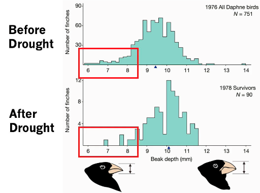

Evolutionary response of G. _fortis_ after the drought

- Decline in population size
- Decrease in seed abundance
- Increase in seed hardness

-> increase in weight, wing length, tarsus length, bill length, bill depth, and bill width

Note: Survival is not random. Larger birds are more likely to survive than the smaller birds

Summary

- Role of adaptations (morphology and behaviour) may be evident only during times of stress and competition
- Without competition:
  - Variation fills in
  - Less selection on the adaptations
- With competition:
  - adaptations become important
  - increase in selection
  - decrease in variation

Genetics of beak morphology

- Gene Bmp4 is responsible for beak depth
- Candidate gene from chicken
- Finches with deeper beaks have strong expression of Bmp4

### Humans and Chimpanzees

- Chimpanzees are humans' most closely related species
- Humans have 23 chromosomes while Chimpanzees have 24

What happened to that chromosome?

- Prediction 1: It was lost, we didn't need those genes (through natural selection)
- Prediction 2: A Creator distributed the genes differently, didn't need as many chromosomes
- Prediction 3: There has been a **fusion event**
  - Compelling evidence: conservation of gene structure/order, common ancestry
  - Chromosome 2 of Human and Chimp shares a common structure

### Predictions based on evolution

#### If life originated on Earth in the distant past and then evolved, then we should see evidence in the fossil record

- First detectable traces of life on earth should be simple forms -> more complex forms later
- Fossils: occur when organismal features are preserved long after death

Note: fossil records is incomplete

- Soft-bodies preserved less than hard
- Rare species even rarer
- Lack of sedimentation
- Highly dependent on conditions - few were fossilized
- Formed through **permineralization**: organism is buried, filled with mineral rich waters, turns tissue to stone, cellularly

There are organic materials preserved from 'recent time' which are not fossil records e.g., Baby mammoth - 40,000 y/o

Geological Dating

- Geological [strata](#stratum) are arranged in order:
  - Oldest = Deepest
  - Geological processes may move strata after formation
- **Radiometric dating** from [isotope](#isotope) half-life provides absolute age
  - Recent (~50,000 years) - Radiocarbon dating (Carbon, $^{14}C$)
  - Older (> millions of years) - Radioactive dating (Uranium - Lead)
  - Quantify how much of these atoms are remaining in the fossil

1. Radiocarbon dating

- Neutrons emitted from the cosmic radiation collides with $^{14}N$ to create $^{14}C$
- $^{14}C$ bonds with oxygens to form $CO_2$ and ends up in plants and animals through photosynthesis and plant consumption
- After organisms die and are buried, $^{14}C$ decays to the stable $^{14}N$
- Half the $^{14}C$ turns to $^{14}N$ every 5730 years
- The level of $^{14}C$ in plants and animals when they die approximately equals the level of $^{14}C$ in the atmosphere at that time
- Directly compared with know year-by-year data from tree-ring data (~13,000 years), ocean and lake sediments, corals and [stalagmites](#stalagmite) (now ~55,000 years)

2. Radioactive Dating

- Uranium 235/238, Error: 2 million years in 2.5 billion years
- Measure the ages of rocks

The earliest life form

- **Cyanobacteria**: first appeared on earth 3.5 billion years ago

#### If evolution occured within lineages, and those lineages sometimes split, then we should see change in species or morphology through the fossil record

- We should sometimes see one lineage dividing into two or more in the fossil record

Example

- Plaktonic diatom, _Rhizosolenia_, samples from deep sea bore holes
  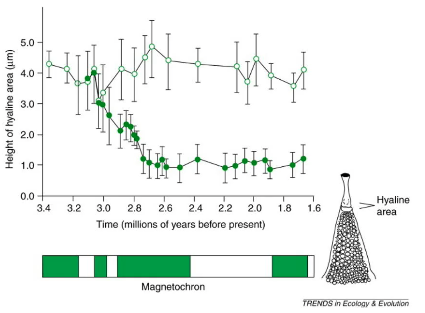
- Marsh's reconstruction of horse evolution
  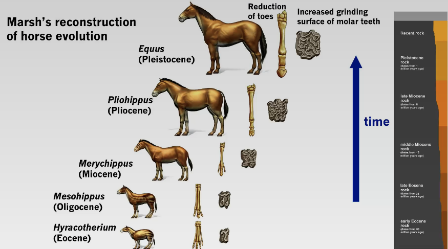
  Note the non-linear change
  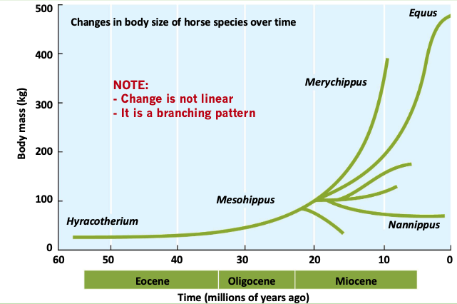

Note: Conservation of structure in fossil records (homology)

#### If creatures share a common ancestry, then we should see transitional forms

- Transitional forms show the **intermediate** states between an ancestral **form** and that of its descendants

Example

- Archeopteryx has boned tails -> transitional form of modern birds
- Tiktaalik has eyes above, can sort of walk -> transitional form between fish and amphibian
  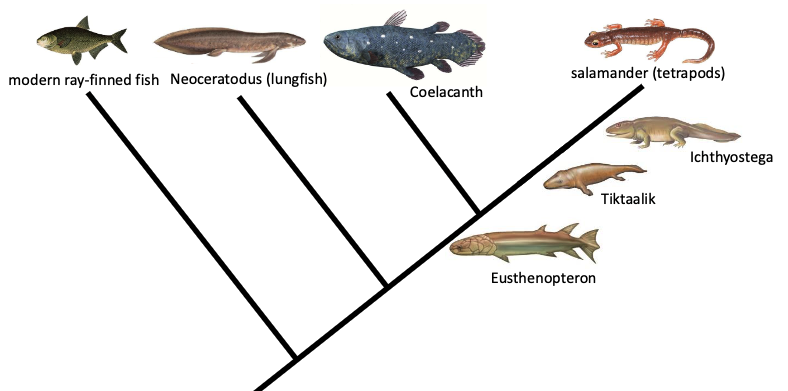

#### We should see evidence of retrodictions and vestigial characters

**retroduction**: makes sense only in light of evolution, but is not necessarily predicted by evolution

Examples

- Retrodictions in biogeography

  - Lack of [endemic](#endemic) mammals, amphibians, and freshwater fish on oceanic islands e.g., Lord Howe, Galapagos
  - These islands rise _de novo_ from sea, devoid of life
  - Mammals on continental islands (Madagascar)
  - Plenty of endemic plants, birds, and insects
  - Life is similar to nearest mainland

- Whales
  - **Atavism**: legs in humpback whale, have appropriate bones

**Vestigial characters**

- Forelimb and Hindlimb spotted in dolphin embryo
- Human fetal yolk sac - empty: we have 3 genes for making yolk proteins, but they are nonfunctional e.g., silenced

  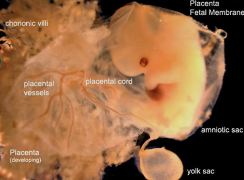

- Humans have genes for making vitamin C but does not work

## Classification

### Cladogram of Vertebrates

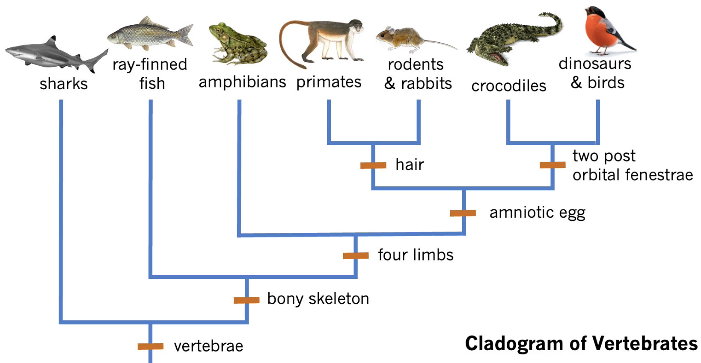
[amniotic](#amniotic-egg) [egg](#amniotic-egg)

[two](#two-post-orbital-fenestrae) [post-orbital](#two-post-orbital-fenestrae) [fenestrae](#two-post-orbital-fenestrae)

### Hierarchical Classification

- **Common names**: convey meaning in casual usage (monkey, finch, lilac)
  - may cause confusion - some do not accurately reflect the type of organism e.g., Jellyfish
- **Scientific names**: Latin, avoid ambiguity
  - Instituted in $18^{th}$ century by Carolus Linneaus

Example

- Linneaus also grouped them into a hierarchy of increasingly inclusive categories
- _Panthera_ genus:
  - _Panthera pardus_ - Leopard
  - _Panthera leo_ - African lion
  - _Panthera tigris_ - Tiger
  - _Panthera onca_ - Jaguar

Hierarchy
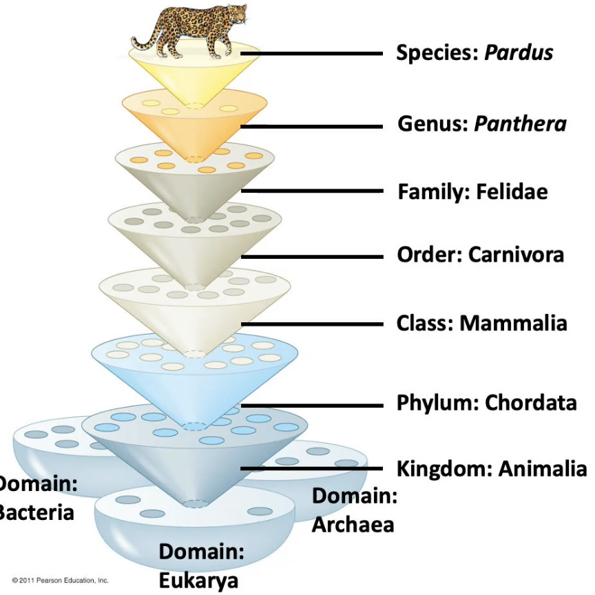

Ancestral Lineage
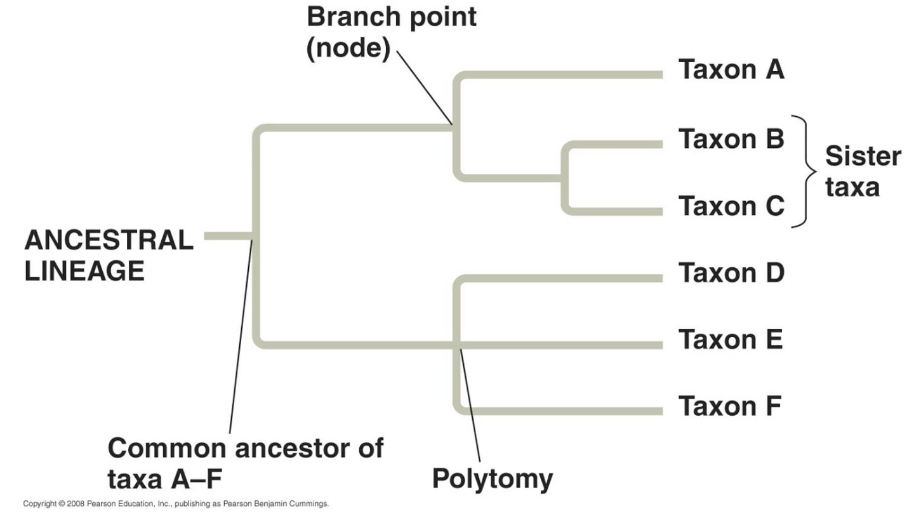

Note: a species must have only one species that is most closely related to -> polytomy needs to be resolved

### Phylogenetic trees

- Evolutionary history of a group of organisms can be represented in a grouping diagram called a **phylogenetic tree**
- **Phylogenetic tree**: a simple 2D, bi-furcating diagram that captures the evolution and diversification of a group of organisms through time
- Difference from cladogram: a phylogenetic tree is time calibrated
  - Poisition of the nodes is rooted in time
  - Length of the branches indicate how long that lineage has been around for
- **Systematics**: the science of organizing the history or organismal evolution; use phylogenies
- Trees can change topology through rotation without changing evolutionary relationships

### Determining characters for classification

Characters must be _independent_ for use in classification

1. Independent traits cannot have environmental phenotypic variation

- **Phenotypic plasticity**: a change in the phenotype associated with a given genotype in response to different environmental conditions
- Must be independent from phenotypic plasticity

2. Independent traits must be _independent_

- **Pleiotropy**: expression of multiple unrelated traits by a single gene
- Avoid pleiotropy when selecting traits for phylogeny
- e.g., frizzled feather trait in chickens involve bunch of other traits:
  - higher body temp
  - mature later
  - higher food consumption
  - lay fewer eggs

## Phylogeny

### Tracing phylogenetic patterns

- Constructed using hundreds or thousands of traits
- **Phylogenies are hypothesis** that can change as we obtain new data or apply new methods of constructing the phylogeny
- Considered the true evolutionary relationships when multiple lines of evidence and multiple methods of analysis converge on the same tree
- Computer programs support analysis of traits and tree constructions (e.g., MEGA, Mr. Bayes, PAUP)

### Beauty of Phylogenies

- **Combined with information on the fossil record**, phylogenies can give us a glimpse of the temporal patterns of diversification (e.g., a time of evolution)
- **Combined with biogeographic data**, we can infer _dispersal events_ and [_vicariance_](#vicariance) e.g., Raffelsia
  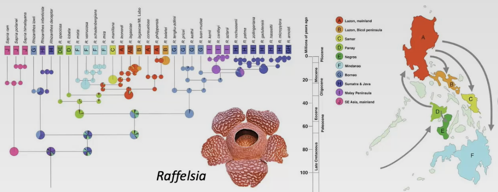
- **Combined with behaviour, ecology, or morphology data**, phylogenies help us understand the origin and loss of traits and predict traits of unstudied species

### Applications of Phylogenies

- Enhancement in understanding of evolution
- Control of agriculture pests and diseases
- Identification of endangered species and managing wildlife
- Selection of plants and animals for research
- Data needed to test **homologous** vs. **analogous** relationships

### Homologous vs Analogous

**Homologous** traits: similar origin

- Result from common ancestry
- A product of **divergent** evolution
- Fundamental to systematics
- Similar structure and embryonic formation

**Analogous** traits: similar function

- Do not result from common ancestry
- **Homoplasy** (hom-: similar, -plasia: formation):
  - Outcomes of [**convergent**](#convergent-evolution) [evolution](#convergent-evolution)
  - Convergent evolution can be a result of adaptive radiations that occur in [**Allopatry**](#allopatry) e.g., Mammals / [Marsupisals](#marsupisal)
    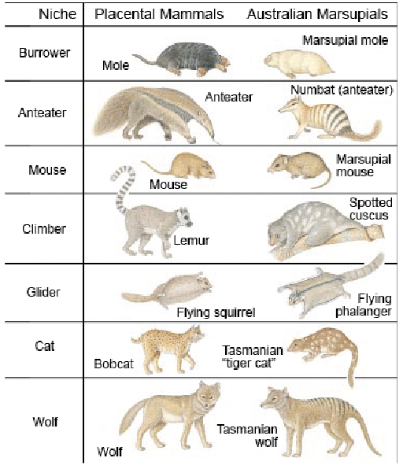
  - Can be as simple as single gene changes, or complex and involve reorganization of multiple systems to converge on a solution
  - e.g., human eyes vs. octopus eyes
  - e.g., halteres in crane flies and twisted wing parasites (used for **gyroscopy**: to detect the deviation of an object from its desired orientation)
  - Not used in systematics
- Different from the conservation of structure (homology)

### Ancestral vs Derived

Inherited traits may be **ancestral** or **derived** depending on the point of reference in phylogeny

- **Ancestral**: a trait that was present in the ancestor of a group/clade
- **Derived**: a trait that differs from close ancestral trait

  - Deteremined from fossils and embryos/larval stage
  - Derived characters appear later in development
  - Help define [**outgroup**](#outgroup) **comparison** for derived characters

- Outgroup limitations: a character can revert from a derived state back to the ancestral state

Note: derived traits are a subset of ancestral traits (derived traits are somewhat considered the ancestral traits)

- **Synapomorphy**: **derived traits** that are shared among a group of descendants and are viewed as evidence of the common ancestry of the group
  - e.g., the vertebral column is a synapomorphy(syn-: one, apo-: related to, -morphy: form) of all vertebrates when considering all animals
  - e.g., milk production is a synapomorphy of all mammals when considering all vertebrates

### Monophyletic vs Paraphyletic vs Polyphyletic

- **Monophyletic group**: a common ancestor and all of its descendants
  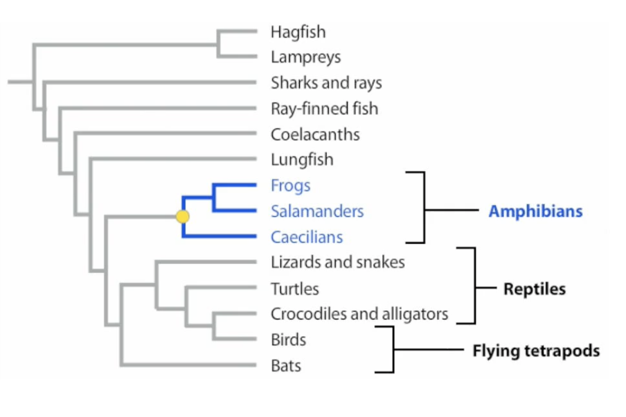
- **Paraphyletic group**: a common ancestor and some of its descendants
  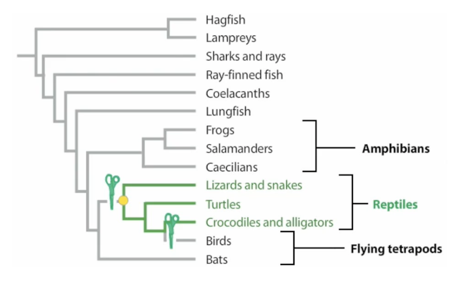
- **Polyphyletic group**: does not include the common ancestor
  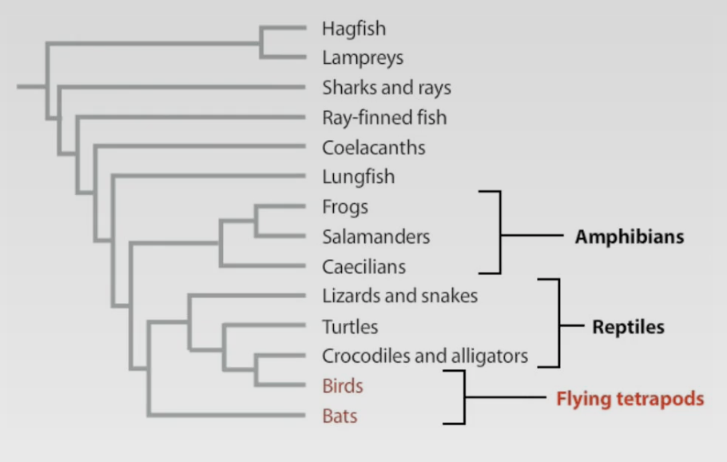

### Construction of Phylogenetic Trees

- **Principle of Parsimony**: the simplest explanation is most likely to be correct (unless other context provided)
- We assume that change is an unlikely event
  - Evolution of a character twice is extremely unlikely
  - Evolutionary trees with derived characters appearing once are most parsimonious
- Minimize the changes -> minimize the homoplasies

### What traits to use?

1. Morphological

- Most species have been described on the basis of morphological data e.g.,
  - features of skeletal system in vertebrates
  - floral structures in plants
  - external features of exoskeleton in insects
- Limitations
  - comparing distantly related species -> too different
  - some species show few morphological differences -> too similar
  - some morphological variation affected by the environment

2. Developmental

- Similarities in development patterns may reveal evolutionary relationships (look at embryos) e.g.,
  - Sea squirts and vertebrates all have a _notochord_ at some time in their development
- Limitations
  - complicated to quantify

3. Paleontological

- **Fossil** provide information about morphology of past organisms, and where and when they lived
- Important in determining _derived_ and _ancestral_ traits
- Important in determining when lineages diverged
- Limitations
  - Fossil record is fragmentary and missing for some groups

4. Behavioural

- Some behavioural traits are inherited e.g.,
  - Frog calls are genetically determined and can be used in phylogenetic trees
- Limitations
  - Some behavioural traits are culturally transmitted
  - e.g., bird songs are often learned and may not be a useful trait

5. Molecular characters

- DNA, RNA, and amino acids changes reflect evolution
- Pros:
  - Abundant data
  - Easier comparison of distant or very close relations
  - No direct environmental effect
- Cons:
  - Only four states in nucleotides, 20 in amino acids
  - Base changes may have evolved independently
- **Molecular Clocks**: the number of changes, or mutations, which accumulate in the gene sequences of different species over time is relatively constant
  - Each DNA sequence has a different clock tick
  - Molecular differences between pairs of species are proportional to the time of their separation -> used to determine the time of divergence
- Analysis of molecular characters
  - Sequence of amino acids or nucleotide bases reflects evolutionary relationships
  - Less similarities in sequence: more distant relation
  - Sequences must be aligned to the same position as mutations can change the length of DNA
  - Mitochondrial, chloroplast, and nuclear DNA are all used
  - Comparison with reference database

### Modern approach

- Maximum likelihood & Bayesian-based tree building algorithms
  - useful when quality/quantity of data does not permit parsimony

## Speciation

### What is a species?

- Smallest independently evolving unit
- Species follow independent evolutionary trajectories
- Defining species is extraordinarily contentious
- \>20 different species concepts

Linnaeus' morphological species concept

- Linnaeus defined species based on their appearance
- Originated [binomial](#binomial-system-of-nomenclature) [system](#binomial-system-of-nomenclature) [of](#binomial-system-of-nomenclature) [nomenclature](#binomial-system-of-nomenclature)
- Idea: members of species look alike because they share many alleles
- Limitations
  - Does not reflect **sexual dimorphism**
  - Immature individuals may not look like their parents (life cycle)

More concepts

1. Biological species concept

- A species is a group of organisms that can interbreed and produce fertile offspring
- Limitations
  - Species hybridize and may produce offspring
  - Plant cultivars
  - Asexual organisms e.g.,
    - an **androdioecous species**: males and hermaphrodites coexist
    - a **gynogenetic species**: embryo only contains maternal chromosomes due to activation of an egg by sperm that degenerates without fusing with the egg nucleus

2. Ecological species concept

- A species is a group of organisms that share a distinct ecological niche
- Idea: different species use ecological resources differently, to become divergent in behaviour and location
- Not commonly used

3. Phylogenetic species concept

- A species is a group of organisms bound by a unique ancestry
- Limitation
  - **Introgression** due to hybridization

Why controversial?

- Species are dynamic, evolving individuals, but we attempt to force them into rigid classes
- Life is always in transition
- All extant taxa are changing
- Nature does not conform to our boundaries of classification

### Giraffes

- 5 to 10 different subspecies of giraffes exist
- distinctions based on geographic range
- distinctions based on pelage pattern
- Some difference in pelage is not associated with geographic barriers
- Through mitochondrial DNA sequence analysis, and nuclear microsatellite loci analysis, six genealogically distinct lineages are found

### Speciation

- When gene flow is reduced between population, they may diverge genetically due to **mutation**, **natural selection**, **genetic drift**
- This genetic divergence may lead to **speciation**

### Types of Isolation

- **Prezygotic isolation**: occurs when individuals of different species are prevented from mating
  - Breed in different places
  - Breed at different times
  - Sexual selection - females only attached to same species
  - Genitalic incompatibility
- **Postzygotic isolation**: occurs when individuals from different populations do mate, but the hybrid offspring produced have low fitness and do not survive or are not fertile
  - Sterile hybride - e.g., horse + donkey = mule
  - Reduced fitness of hybrids
  - [Polyploidy](#polyploidy)
  - Limitations
    - The crieterion cannot be evaluated in fossils or in species that reproduce asexually
    - Can only applied to populations that overlap geographically ([**sympatry**](#sympatry))

#### Isolation and divergence in allopatry

- Genetic isolation happens when populations become physically separated
- Populations that live in different areas are said to be **allopatric**
- Physical isolation occurs by dispersal or vicariance (separated themselves or separated by the environment)
- **Allopatric speciation**: speciation that begins with physical isolation
- **Biogeography** can tell us how colonization and range-splitting events occur
  - **Dispersal** occurs when a population moves to a new habitat, colonizes it, and form a new population -> **gene flow** $\downarrow$, **genetic drift** via the _founder effect_ catalyzes speciation, different **natural selection** if new environment is different
  - **Vicariance** occurs when a physical barrier splits a widespread population into subgroups that are physically isolated from each other
    - Vicariance events during the last ice age, when glaciers served as physical barriers are thought to be responsible for the origin of many modern species
    - **Continental drift**: the movement of continental plates explained by the theory of plate tectonic
    - Continental drift separated species physically over the long time

#### Isolation and divergence in sympatry

- Populations or species that live in the same geographic region (close enough to mate) live in **sympatry**
- **Natural selection** can overcome **gene flow** and cause **sympatric speciation**

Example

- Hawthorn flies started laying eggs in both hawthorns and apples after the introduction of apple trees
- Hawthorns have better nutrition
- Apples have fewer parasitism
- **Disruptive selection** occured and ended up with the creation of apple maggot flies
- Hawthorn maggot flies and apple maggot flies prefer to mate on hawthorn fruit and apple fruit, respectively
- They still can mate -> no speciation yet

### Polypoidy leading to speciation

- For example, tetraploid individuals are genetically isolated from wild-type individuals because they produce diploid gametes rathe rthan haploid gametes
- If these gametes combined, the resulting zygote would be triploid
- Triploid individuals produce gametes with a dysfunctional set of chromosomes e.g., seedless bananas

Autopolyploidy

- Chromosome duplications within a species
- Unreduced gametes receive same _n_ as somatic cell, error in meiosis
- Odd chromosome numbers usually sterile (except plants and fungi)

Allopolyploidy

- Chromosome duplications between species
- Doubling of hybrid species chromosomes make them fertile

Evolution of Wheat

- Diploid wild wheat, _Triticum monococcum_, has two sets of 7 chromosomes (14AA)
- Long ago, _T. monococcum_ hybridized with another species that had the same number of chromosomes (14BB)
- The AB hybrid offspring were sterile (14AB)
- Polyploidy arose in the hybrids (28AABB), and they are fertile because at meiosis, A chromosomes pair with each other and B chromosomes pair with each other
- Later, 28AABB hyberdized with _T.tauschii_ (14DD)
- The hybrid descendants (42AABBDD) include common bread wheats, such as _T. aestivum_

### Chromosome alterations

- Closely related species often differ in chromosomal arrangement
- Chromosomal rearrangements lead to higher rates of protein evolutionary divergence
  - **Inversions**: breakage, rearrangement withint itself
  - **Translocations**: exchange between non-homologous chromosomes
  - **Deletions**: mutation leading to loss of nucleotides
  - **Duplications**: part of chromosomes duplicated
- Fast speciation

### When isolated populations come into contact

Divergence

- If two populations have diverged and if divergence has affected when, where, or how individuals in the populations mate, **prezygotic isolation** exists
- Then, mating between the populations is rare, gene flow is minimal, and continue to diverge

Introgression

- With no **prezygotic isolation**, populations may interbreed
- **Introgression**: gene flow then occurs and may erase distinctions between the two populations

Development of Hybrid zones

- Sometimes the hybrid offspring of related species possess traits that are intermediate between the two parental populations, healthy and capable of breeding
- **Hybrid zone**: a geographic area where interbreeding between two populations occur and hybrid offspring are common

Reinforcement

- If two populations of related species have diverged extensively and are distinct genetically, their hybrid offspring will most likely have lower fitness and will not develop or reproduce normally
- **postzygotic isolation**
- Strong natural selection against interbreeding
- **Reinforcement**: selection for traits that isolate populations reproductively
- **Sympatric** species that are close relatives living in the same area are rarely willing to mate with one another
- **Allopatric** species that are close relatives living in different areas are often willing to mate with one another

Others

- Reinforcement
- Speciation by hybridization

## Terminologies

**niche**: the position of a species within an ecosystem, describing both the range of conditions necessary for persistence of the species, and its ecological role in the ecosystem

**virulence**: the quality of being poisonous or injurious to life

**population**: individuals of species at same time and same place, interbreed, producing fertile offspring

**gene pool**: all the alleles present in all individuals in a population or in a species e.g. alleles for skin colour, hair type, eye colour, etc

**populations**: all the individuals of a given species that live and reproduce in the same geograhpical area; one of several interbreeding groups of organisms of the same species living in the same geographical area

**paternity**: a state of being someone's father

**metamorphosis**: a biological process by which an animal physically developes including birth transformation or hatching, involving a conspicuous and relatively abrupt change in the animal's body structure through cell growth and differentiation

**retrodiction**: an explanataion of past actions or events

**stratum**: a layer of a series of layers of rock in the ground

**isotope**: an atom with the same number of protons but different number of neutrons

**stalagmite**: a type of rock formation that rises from the floor of a cave due to the accumulation of material deposited on the floor from ceiling drippings

**endemic**: endemic species are those that live in a limited area

**amniotic egg**: eggs that contain an amnion to protect the embryo

**two post orbital fenestrae**: the two openings in the skull behind the eye
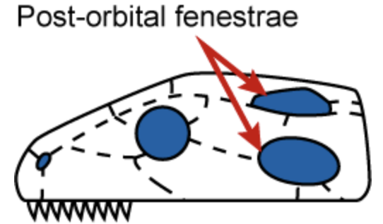

**vicariance**: a lineage splits due to geological events e.g., the breakup of continents, new island formations the uplifting of a new mountain range

**convergent evolution**: when two or more different organisms independently evolve the ability to do the same thing

**allopatry**: a population of species that is physically isolated from other similar groups by an [extrinsic](#extrinsic) barrier to dispersal

**extrinsic**: a factor that is not in control

**marsupisal**: a diverse group of mammals belonging to the infraclass Marsupialia. They are natively found in Australasia, Wallacea, and the Americas

**outgroup**: a lineage that falls outside the group being studied but is closely related to that group

**binomial-system-of-nomenclature**: combination of two names into one to give all species unique scientific names. The first part is called the genus and the second part is called the specific epithet

**polyploidy**: the heritable condition of possessing more than two complete sets of chromosomes, common in fungi and plants

**sympatry**: two populations co-existing in the same place

**polymorphism**: variable nucleotide positions

**lethal**: sufficient to cause death

**genetic drift**: a random change in the frequency of an allele due to the statistical effects of finite population size

**allele frequency**: commonndess or rarity of each allele in the gene pool assuming individuals are diploid and both gametes contribute to the production of offspring

**herd**: a social group of certain animals of the same species

**heterozygote advantage**: a form of balancing selection in which the heterozygote's fitness is higher than that of either of the homozygotes resulting in selection that ensures that both alleles remain in the population at intermediate frequencies
